# 期货现货结合业务实现思路 —— B2B大宗贸易场景

> **定位**: 面向技术经理的架构分析与业务设计框架，关注「为什么这么设计」而非「怎么写代码」。
> **适用场景**: B2B大宗商品（钢铁/农产品/能源/化工）平台的期现结合业务。
> **来源**：2026-10-05 从 `03-业务场景与痛点全景手册.md` 拆分独立成篇。
> **相关材料**：痛点体系 → `05-业务痛点与系统解决方案-架构详解.md`；现货全链路 → `02-业务全链路场景手册.md`；异构架构 → `../03-架构决策与问题排查/02-异构架构策略与真实系统叙事手册.md`。

---

## 目录

1. [业务场景与目标定义](#1-业务场景与目标定义)
2. [期货与现货结合的策略模式](#2-期货与现货结合的策略模式)
3. [关键业务流程设计](#3-关键业务流程设计)
4. [风险控制机制](#4-风险控制机制)
5. [系统架构与数据流设计](#5-系统架构与数据流设计)
6. [各环节异常处理方案](#6-各环节异常处理方案)
7. [面试话术框架（技术经理视角）](#7-面试话术框架技术经理视角)
8. [附录A：期现结合系统核心能力自检清单](#附录a期现结合系统核心能力自检清单)
9. [附录B：行业参考](#附录b行业参考)

---

## 1. 业务场景与目标定义

### 1.1 核心场景矩阵

| 场景编号 | 场景名称 | 参与角色 | 业务痛点 | 期现结合价值 |
|----------|----------|----------|----------|-------------|
| S1 | 钢厂锁定加工利润 | 钢厂采购部 | 铁矿价格波动侵蚀利润 | 买入铁矿期货 + 卖出螺纹钢期货 = 锁定利润 |
| S2 | 贸易商库存保值 | 贸易商 | 囤货期间价格下跌风险 | 卖出等量期货合约对冲现货库存 |
| S3 | 下游锁价采购 | 终端用户 | 担心未来原材料涨价 | 通过平台预先锁定价格，平台用期货对冲 |
| S4 | 跨品种套利 | 机构交易者 | 品种间价差异常 | 同时做多/做空关联品种，赚取价差回归收益 |
| S5 | 基差投机 | 专业投机者 | 期现价差偏离合理区间 | 做多基差(买现卖期)或做空基差(卖现买期) |
| S6 | 仓单质押融资 | 贸易商+银行 | 库存占压资金大 | 标准仓单质押获得低成本融资 |

### 1.2 业务目标定义

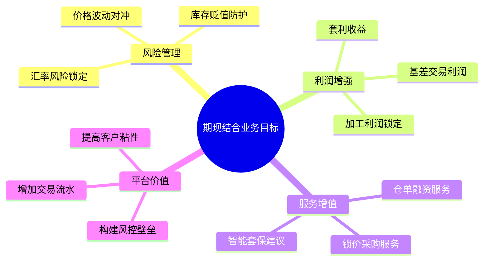

### 1.3 输入/输出与约束

| 维度 | 内容 |
|------|------|
| **核心输入** | ① 实时期货行情(K线/分时/深度)；② 现货报价(仓库/钢厂/港口)；③ 用户持仓(期货持仓+现货库存)；④ 交易所规则(保证金/涨跌停/交割) |
| **核心输出** | ① 套保方案建议；② 风险敞口报告；③ 保证金占用预估；④ 盈亏归因分析 |
| **关键约束** | ① 期货T+0 vs 现货T+N交收；② 最小交易单位(手) vs 现货起订量(吨)；③ 交割库与现货仓库的地理错配；④ 保证金追缴的时效要求(通常T+1 15:00前) |

---

## 2. 期货与现货结合的策略模式

### 2.1 策略全景图

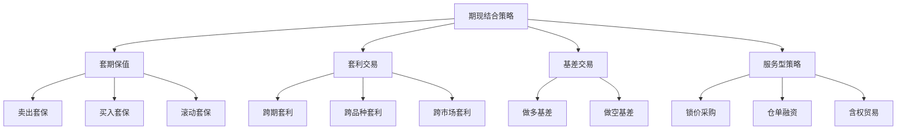

### 2.2 各策略详细分析

#### 策略一：卖出套期保值（Short Hedge）

| 要素 | 描述 |
|------|------|
| **目标** | 对冲现货库存的贬值风险 |
| **操作** | 持有现货多头 → 在期货市场卖出等量空头合约 |
| **输入** | 现货库存量(吨)、当前现货价格、对应期货合约价格 |
| **输出** | 套保比率建议、保证金占用、对冲效果评估 |
| **适用条件** | ① 有现货库存；② 预期价格下行；③ 期货合约有流动性 |
| **关键参数** | 套保比率 β = 期货数量/现货数量 (通常0.7-1.0)；合约月份选择(主力合约优先) |
| **平台收益** | 收取交易佣金 + 套保服务费 |

**工作原理**：
```
价格下跌场景：现货亏损 + 期货空头盈利 = 净亏损大幅缩小（完美对冲时≈0）
价格上涨场景：现货盈利 + 期货空头亏损 = 净盈利大幅缩小（放弃了上涨收益）
→ 本质：锁定当前价格，减少不确定性
```

#### 策略二：买入套期保值（Long Hedge）

| 要素 | 描述 |
|------|------|
| **目标** | 锁定未来采购成本，防止原材料涨价 |
| **操作** | 未来需采购现货 → 现在买入期货多头合约 |
| **输入** | 未来采购量/时间、当前期货价格、预算上限 |
| **输出** | 建仓时机建议、成本锁定效果、盈亏概率分析 |
| **适用条件** | ① 未来确定有采购需求；② 预期价格上涨；③ 有保证金支付能力 |

#### 策略三：跨品种套利（Spread Trading）

| 要素 | 描述 |
|------|------|
| **目标** | 利用关联品种价差异常赚取回归收益 |
| **操作** | 做多低估品种 + 做空高估品种 |
| **典型组合** | ① 螺纹钢-热卷(RB-HC)；② 豆油-豆粕(Y-M)；③ 焦炭-焦煤(J-JM)；④ 铁矿-螺纹钢(I-RB) 即钢厂利润套利 |
| **输入** | 两品种历史价差序列、当前价差位置、价差均值与标准差 |
| **输出** | 入场信号(价差偏离>2σ)、目标价差、止损价差 |
| **关键约束** | 两合约乘数可能不同，需调整手数比例 |

**螺纹钢-热卷套利实例**：

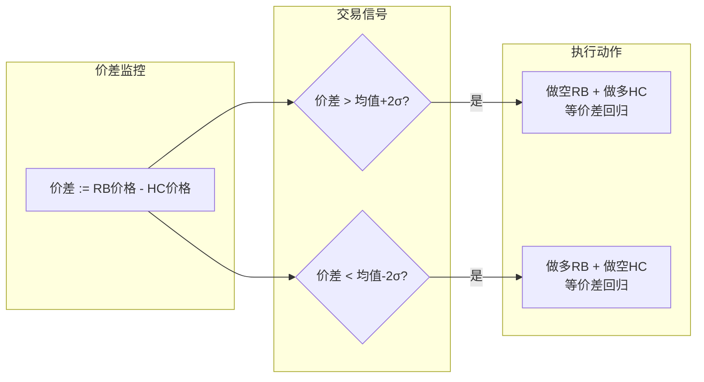

#### 策略四：基差交易（Basis Trading）

| 要素 | 描述 |
|------|------|
| **目标** | 利用期现价差异常波动赚取基差回归收益 |
| **核心概念** | 基差 = 现货价格 - 期货价格。正常市场：现货>期货(正值)；反向市场：现货<期货(负值) |
| **做多基差** | 买入现货 + 卖出期货 → 预期基差扩大 |
| **做空基差** | 卖出现货 + 买入期货 → 预期基差收窄 |
| **关键难点** | 现货端操作需要实际货权和仓储能力，非纯金融交易 |

#### 策略五：锁价采购服务（价值链延伸）

| 要素 | 描述 |
|------|------|
| **业务本质** | 平台为下游客户提供「固定价格+延期提货」服务，背后用期货对冲自身风险 |
| **客户价值** | 锁定采购成本，规避未来涨价风险 |
| **平台风险** | 承担了客户转移的价格风险，必须通过期货市场精确对冲 |
| **计费模型** | 锁价费 = 锁价金额 × 费率(0.3%-1%) + 资金占用利息 |
| **核心能力** | 精确的敞口计算 + 动态对冲执行 + 追保资金准备 |

---

## 3. 关键业务流程设计

### 3.1 总体业务流程

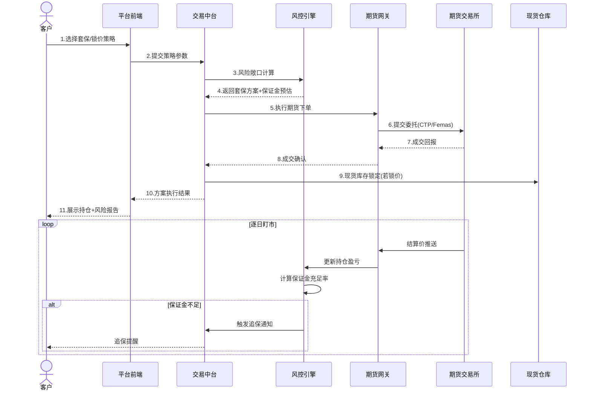

### 3.2 套保方案推荐流程

```mermaid
flowchart TD
    A[客户输入] --> B{场景分类}
    
    B -->|持有现货库存| C1[卖出套保场景]
    B -->|计划采购| C2[买入套保场景]
    B -->|锁定利润| C3[价差套利场景]
    
    C1 --> D1[获取:现货库存数据<br/>现货品种/数量/成本]
    C2 --> D2[获取:采购计划数据<br/>品种/数量/时间/预算]
    C3 --> D3[获取:价差历史数据<br/>两品种价差序列]
    
    D1 --> E[风控引擎计算]
    D2 --> E
    D3 --> E
    
    E --> E1{参数校验通过?}
    E1 -- 否 --> E2[返回:不通过原因+修正建议]
    E1 -- 是 --> E3[生成套保方案]
    
    E3 --> F1[方案要素1:套保比率β]
    E3 --> F2[方案要素2:合约选择(月份)]
    E3 --> F3[方案要素3:手数计算]
    E3 --> F4[方案要素4:保证金预估]
    E3 --> F5[方案要素5:止损/止盈规则]
    
    F1 & F2 & F3 & F4 & F5 --> G[方案预览→客户确认]
    G -- 确认 --> H[执行下单]
    G -- 调整 --> A
```

**套保手数计算公式**：
```
期货手数 = (现货量 × 套保比率) / (合约乘数)
         = (500吨 × 0.8) / (10吨/手)
         = 40手

其中: 套保比率β由两个因素决定:
  ① 期货与现货的相关性 ρ (相关性越高,β越接近1)
  ② 最小方差套保比率 h = ρ × (σ_spot / σ_future)
```

### 3.3 锁价采购核心流程

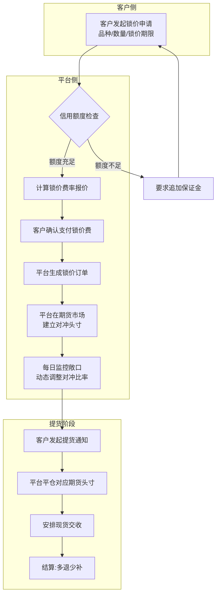

### 3.4 每日盯市与动态对冲流程

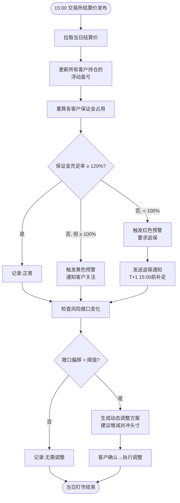

---

## 4. 风险控制机制

### 4.1 风控体系全景

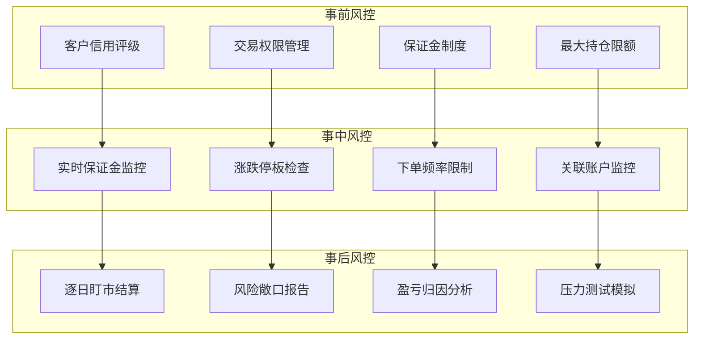

### 4.2 仓位管理规则

| 规则类型 | 计算方式 | 阈值设定 | 超限处理 |
|----------|----------|----------|----------|
| **单品种持仓上限** | 单品种净持仓 / 总权益 ≤ X% | X=20% (保守) / 30% (标准) / 40% (激进) | 拒绝新开仓，提示减仓 |
| **总持仓上限** | 总持仓保证金 / 总权益 ≤ Y% | Y=60% (保守) / 70% (标准) / 80% (激进) | 拒绝新开仓，强制减仓通知 |
| **套保比率偏离** | 实际套保比率 - 目标比率 | 偏离绝对值 ≤ 10% | 触发动态调整建议 |
| **净敞口限制** | 现货多头 - 期货空头净敞口 | 净敞口 ≤ 现货总量 × (1-β_max) | 强制补充对冲头寸 |
| **流动性检查** | 委托量 / 标的日均成交量 | ≤ 5% (避免冲击) | 拆分大单为小单分批执行 |

### 4.3 止损规则设计

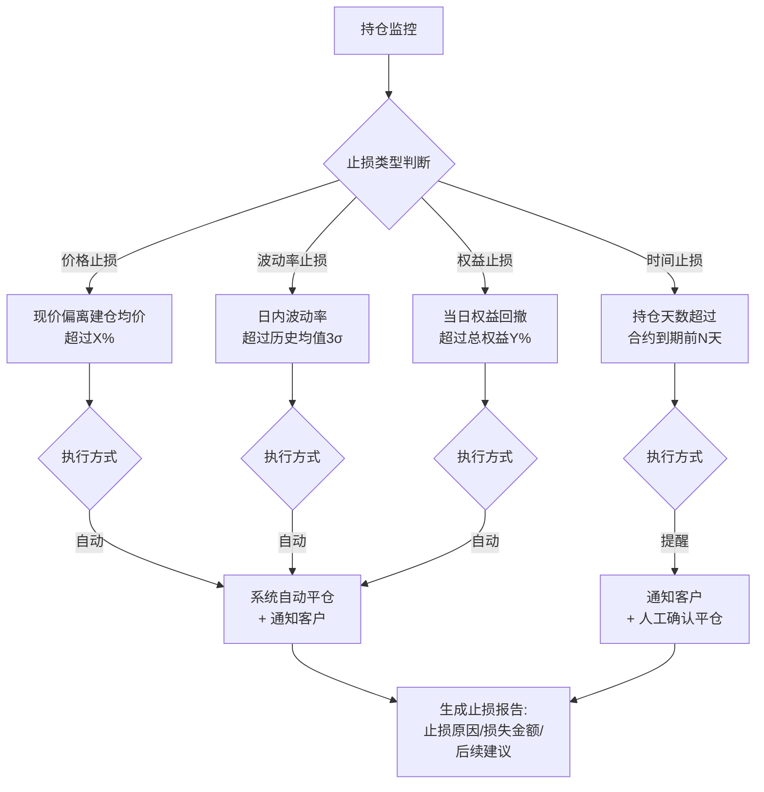

**止损参数推荐**：

| 策略类型 | 价格止损 | 权益止损 | 时间止损 | 执行方式 |
|----------|----------|----------|----------|----------|
| 卖出套保 | 不设止损(现货对冲) | 不设止损 | 合约到期前5天展期 | 提醒 |
| 买入套保 | 不设止损(成本锁定) | 不设止损 | 合约到期前5天展期 | 提醒 |
| 跨品种套利 | 价差回撤>1.5σ | 总权益回撤>5% | 价差15天未回归 | 自动 |
| 基差交易 | 基差逆向>2σ | 总权益回撤>3% | 合约到期前7天平仓 | 自动 |
| 锁价对冲(平台侧) | - | 保证金追缴 | - | 自动 |

### 4.4 保证金监控体系

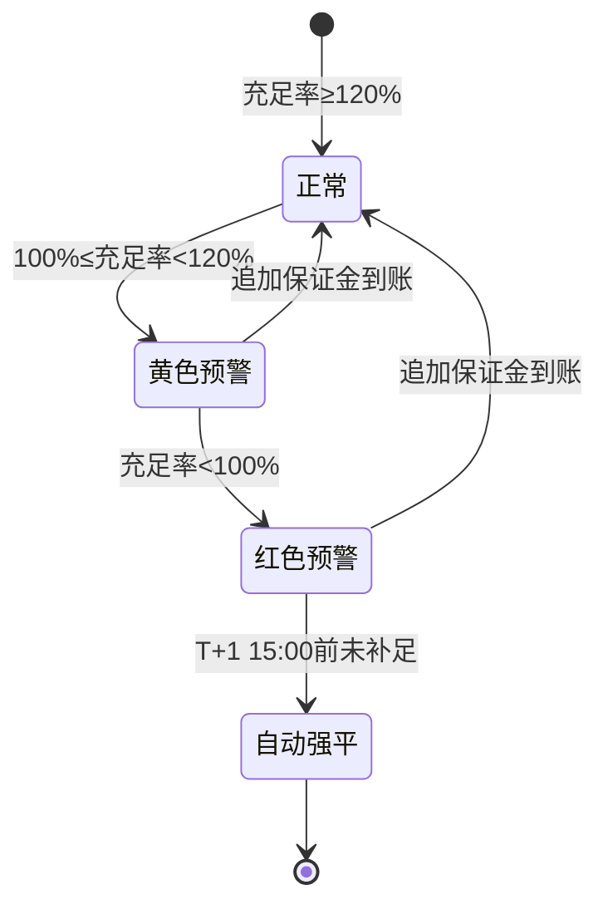

**保证金监控关键指标**：

| 指标 | 公式 | 预警阈值 | 强平阈值 |
|------|------|----------|----------|
| 保证金充足率 | (权益-浮动亏损) / 占用保证金 | < 120% 黄色预警 | < 100% + T+1未补 |
| 可用资金 | 权益 - 占用保证金 - 浮动亏损 | < 0 | 触发追保 |
| 风险度 | 占用保证金 / 权益 | > 80% 注意; > 90% 预警 | > 100% 强平 |

### 4.5 信用风险管理

| 管理环节 | 措施 | 工具/方法 |
|----------|------|-----------|
| 准入评估 | 企业资质审核、历史交易记录、财务报表 | 工商信息核验 + 天眼查/企查查对接 |
| 额度授信 | 基于净资产、交易量、历史履约率计算 | 授信额度 = min(净资产×5%, 历史最大持仓×3) |
| 动态调整 | 根据履约率、市场波动动态调整额度 | 履约率<95%:降额20%; 市场波动率>30%:降额30% |
| 担保措施 | 保证金+标准仓单质押+第三方担保 | 保证金比率 = 基础比率 + 信用风险溢价 |

---

## 5. 系统架构与数据流设计

### 5.1 总体系统架构

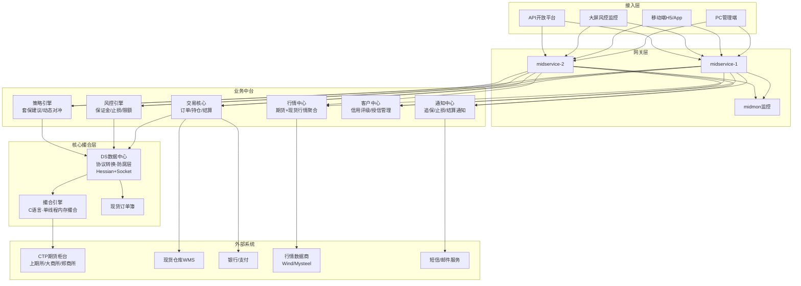

### 5.2 数据流设计

#### 5.2.1 行情数据流

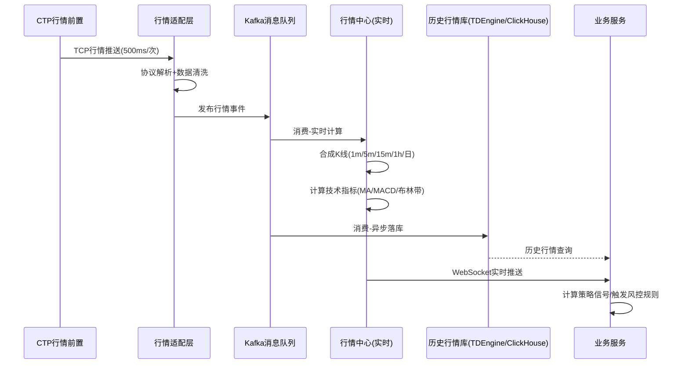

#### 5.2.2 交易数据流

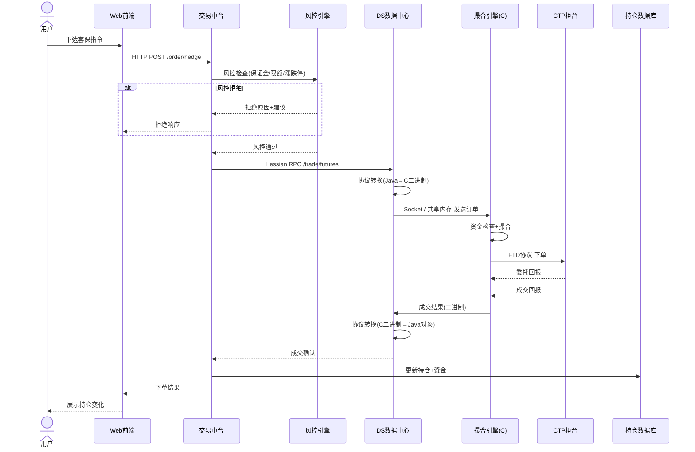

#### 5.2.3 结算数据流

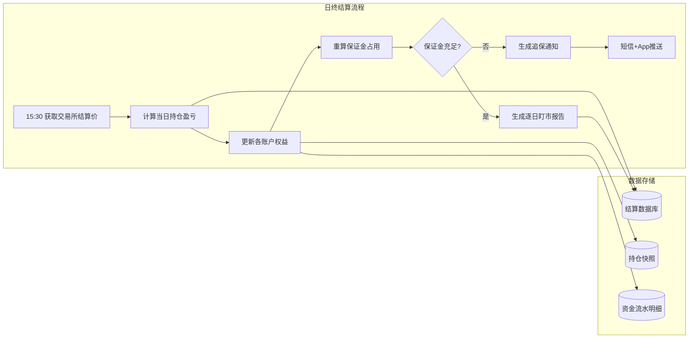

### 5.3 关键数据模型设计

#### 持仓聚合模型

| 字段 | 类型 | 说明 |
|------|------|------|
| account_id | varchar(32) | 账户唯一标识 |
| instrument_id | varchar(16) | 合约代码(如rb2601) |
| position_type | tinyint | 1=期货多头, 2=期货空头, 3=现货库存 |
| volume | decimal(20,4) | 持仓量(吨/手) |
| avg_price | decimal(20,4) | 建仓均价 |
| market_price | decimal(20,4) | 最新市价 |
| floating_pnl | decimal(20,4) | 浮动盈亏 |
| margin_used | decimal(20,4) | 已用保证金 |
| hedge_ratio | decimal(10,4) | 当前套保比率 |

#### 风险敞口表

| 字段 | 类型 | 说明 |
|------|------|------|
| exposure_id | varchar(32) | 敞口ID |
| account_id | varchar(32) | 账户ID |
| product_group | varchar(16) | 品种分组(如黑色/有色/农产品) |
| spot_long | decimal(20,4) | 现货多头量 |
| future_short | decimal(20,4) | 期货空头量 |
| net_exposure | decimal(20,4) | 净敞口 = spot_long - future_short × 合约乘数 |
| delta_exposure | decimal(20,4) | Delta敞口(考虑对冲比率的实际风险敞口) |
| var_95 | decimal(20,4) | 95%置信度VaR值 |
| update_time | datetime | 更新时间 |

### 5.4 异构系统通信设计

基于现有架构（C撮合引擎 + Java业务中台），期现结合场景下的通信设计：

```
┌──────────────────────┐
│    Java 业务中台      │
│  ┌────────────────┐  │
│  │  风控引擎       │  │ ← Hessian over HTTP (同步): 风控检查、持仓查询
│  │  策略引擎       │  │ ← Socket (异步): 订单提交、成交回报、行情推送
│  │  交易核心       │  │
│  └───────┬────────┘  │
└──────────┼───────────┘
           │
    ┌──────▼───────────┐
    │  DS 数据中心      │  ← Anti-Corruption Layer
    │  (Java 防腐层)    │    协议转换: Java ↔ C二进制
    │  ┌────────────┐  │    序列化: Hessian
    │  │ 协议适配器  │  │    通信: Socket + HTTP
    │  │ 数据转换器  │  │
    │  └──────┬─────┘  │
    └─────────┼────────┘
              │
    ┌─────────▼────────┐
    │  C 撮合引擎       │  ← 单线程内存撮合
    │  ┌────────────┐  │    异步落库(不阻塞主循环)
    │  │ 内存订单簿  │  │    对外暴露: 二进制协议接口
    │  │ 撮合主循环  │  │
    │  │ 异步写库    │  │
    │  └────────────┘  │
    └──────────────────┘
```

**DS数据中心在期现结合场景的关键价值**：
- C引擎只暴露二进制协议 → DS将其翻译为Java业务中台可消费的Hessian对象
- 同步调用走Hessian over HTTP（风控查询等低延迟场景）
- 异步推送走Socket（行情、成交回报等高频场景）
- 这种设计让Java技术经理能直接review DS代码，是「管住」异构系统的抓手

---

## 6. 各环节异常处理方案

### 6.1 异常分类框架

```mermaid
flowchart TD
    A[异常分类] --> B[基础设施异常]
    A --> C[业务异常]
    A --> D[市场异常]
    A --> E[数据异常]
    
    B --> B1[CTP连接断开]
    B --> B2[数据库主从切换]
    B --> B3[消息队列积压]
    B --> B4[网络超时]
    
    C --> C1[保证金不足]
    C --> C2[下单被拒(风控)]
    C --> C3[持仓超限]
    C --> C4[合约到期未展期]
    
    D --> D1[涨跌停板]
    D --> D2[流动性枯竭]
    D --> D3[合约临时停牌]
    D --> D4[极端行情(黑天鹅)]
    
    E --> E1[行情数据延迟/缺失]
    E --> E2[结算价异常]
    E --> E3[现货报价失真]
    E --> E4[品种映射错误]
```

### 6.2 各环节异常处理详表

#### 6.2.1 基础设施异常

| 异常场景 | 感知方式 | 自动处理 | 人工处理 | 恢复后处理 | 降级策略 |
|----------|----------|----------|----------|------------|----------|
| **CTP连接断开** | 心跳超时(3s无响应) | 自动重连(最多3次) | 重连失败→通知运维+运营 | 校验未成交订单状态(撤单/重发) | 暂停期货交易，现货交易正常 |
| **数据库主从切换** | 连接池异常捕获 | 连接池自动Failover | 通知DBA排查原因 | 数据一致性校验 | 读操作走从库(可能有延迟) |
| **Kafka积压** | 消费Lag监控 > 阈值 | 扩容消费者实例 | 排查下游处理瓶颈 | 回放积压消息 | 行情降级为轮询模式 |
| **网络超时** | 请求超时(>5s) | 重试机制(最多3次,指数退避) | 网络排查 | 幂等性校验 | 本地缓存兜底 |

#### 6.2.2 业务异常

| 异常场景 | 检测时机 | 处理规则 | 用户通知 | 恢复机制 |
|----------|----------|----------|----------|----------|
| **保证金不足** | 每日盯市+实时下单 | 黄色预警→通知;红色→T+1追保;超期→强平 | 短信+App推送+站内信 | 入金到账→解除预警→恢复交易 |
| **风控拒绝下单** | 下单前事中检查 | 返回拒绝原因+参数建议 | 前端即时展示 | 调整参数→重新提交 |
| **持仓超限** | 下单前+日终检查 | 拒绝超限开仓请求 | 即时告知 | 减仓至限额内→恢复开仓权限 |
| **合约到期未展期** | 到期前5天+3天+1天提醒 | 自动计算展期方案(平旧开新) | 多级提醒阶梯 | 执行展期操作 |

#### 6.2.3 市场异常

| 异常场景 | 识别规则 | 系统响应 | 恢复条件 |
|----------|----------|----------|----------|
| **涨跌停板** | 行情价格=涨跌停价 | 暂停该合约开仓; 按交易所规则排队平仓 | 次日开盘恢复 |
| **流动性枯竭** | 盘口买卖价差>正常5倍 / 成交量<日均20% | 预警提示; 建议等待流动性恢复再操作 | 流动性恢复 |
| **合约停牌** | 交易所公告/行情中断 | 暂停该合约所有操作; 标记持仓为「停牌」 | 交易所公告复牌 |
| **极端行情(黑天鹅)** | 日内波动>历史3σ / 触发熔断 | 全品种暂停新开仓; 收紧止损阈值; 启动应急预案 | 波动率回归正常范围 |

#### 6.2.4 数据异常

| 异常场景 | 检测方式 | 处理策略 | 对业务影响 |
|----------|----------|----------|------------|
| **行情延迟** | 行情时间戳 vs 本地时间 >1s | 切换备用行情源; 标记数据质量 | 策略信号可能滞后; 暂停高频策略 |
| **行情缺失(跳空)** | 前后两笔行情价格跳变>2% | 暂时冻结基于该价格的策略触发; 人工确认 | 套利策略可能误触发 |
| **结算价异常** | 与盘中价偏差>涨跌停5% | 人工复核; 以交易所官方结算价为准 | 影响保证金计算(若有误需回冲) |
| **现货报价失真** | 偏离近期均价>5% / 跨仓库价差异常 | 标记为可疑; 暂停以此为基础的计算 | 基差计算失准 |

### 6.3 极端场景应急预案

```mermaid
flowchart TD
    subgraph 场景一_连续涨跌停
        A1[首日涨停/跌停] --> A2[暂停该品种开仓]
        A2 --> A3[评估客户持仓风险]
        A3 --> A4{有穿仓风险?}
        A4 -- 是 --> A5[启动强平减仓方案]
        A4 -- 否 --> A6[持续监控,每日报告]
        A5 --> A6
    end
    
    subgraph 场景二_交易所系统故障
        B1[无法获取行情/无法下单] --> B2[切换备用柜台(如有)]
        B2 --> B3{备用可用?}
        B3 -- 否 --> B4[暂停期货操作<br/>通知所有客户]
        B3 -- 是 --> B5[使用备用柜台<br/>标记数据源]
    end
    
    subgraph 场景三_账户穿仓
        C1[权益<0] --> C2[冻结该账户所有操作]
        C2 --> C3[通知客户补足资金]
        C3 --> C4{客户是否回应?}
        C4 -- 回应+同意补足 --> C5[设置补足期限+监管]
        C4 -- 不回应/拒绝 --> C6[启动法律追偿程序]
    end
```

### 6.4 异常处理的设计原则

| 原则 | 说明 | 实现方式 |
|------|------|----------|
| **幂等性** | 同一笔订单重复提交不会造成重复成交 | 订单唯一ID + 状态机 + 数据库唯一约束 |
| **可追溯** | 任何异常都有完整的调用链日志 | 分布式Trace ID贯穿全链路 |
| **可回滚** | 关键操作支持补偿/回滚 | Saga模式 + 补偿事务 |
| **降级优先** | 核心路径优先保障，非核心可降级 | 熔断器 + 限流 + 兜底策略 |
| **通知不遗漏** | 追保/强平等关键通知必须有确认机制 | 多通道(短信+App+站内信) + 确认回执 |
| **人工兜底** | 自动处理有上限，关键决策人审 | 自动处理→阈值→人工决策的双层架构 |

---

## 7. 面试话术框架（技术经理视角）

> 以下为面试中阐述期货结合系统时的核心话术，根据你的实际系统架构（C撮合+Java中台+DS防腐层）定制。

### 7.1 系统架构描述

> "我们的期现结合系统采用**异构四层架构**。最底层是**C语言撮合引擎**，单线程内存撮合、异步落库，保证极低延迟。上面是**DS数据中心**，作为防腐层把C引擎的二进制协议翻译成Java对象。再上层是**Java微服务业务中台**，包含交易、风控、策略等12+服务集群。这套架构的核心优势是：**性能关键路径用C保证速度，业务复杂度用Java保证可维护性**。"

### 7.2 风控设计亮点

> "风控我们做了**事前-事中-事后三层**。事前有信用评级和额度授信；事中有**实时保证金监控**和下单校验；事后有**逐日盯市**和压力测试。保证金计算、止损触发这些规则都配置在风控引擎里，可以动态调整。比如锁价业务，我们会**精确计算客户的Delta敞口**，平台侧同步在期货市场建立对冲头寸，每天根据现货库存变化动态调整。"

### 7.3 异构系统通信方案

> "C和Java之间的通信我们用了两种模式：**同步走Hessian over HTTP**，用于风控查询等需要即时返回的场景；**异步走Socket**，用于行情推送和成交回报这种高频场景。DS数据中心就是这个翻译层，它同时把协议转换做好，让Java侧不用关心C内部怎么实现的。**这个DS层是我能直接review代码的地方**，有了它我就能管住整个链路的稳定性。"

### 7.4 最大挑战与解决

> "最大的挑战是**期现头寸的实时敞口计算**。现货端数据来自不同仓库的WMS系统，数据质量参差不齐、更新频率也不一致。期货端是秒级行情。两边要实时对账算出净敞口。我们的解决方案是：**先建一个统一的持仓聚合模型**，用事件驱动的方式把现货入库、期货成交都转成持仓变更事件，然后在内存中实时聚合。异常情况通过**Saga补偿机制**处理，比如期货下单成功但现货入库失败，会自动取消对应的期货头寸。"

---

## 附录A：期现结合系统核心能力自检清单

| 能力域 | 核心能力 | 自检问题 |
|--------|----------|----------|
| 行情 | 多源行情聚合 | 是否支持至少2个行情源做容灾切换？ |
| 交易 | 统一订单管理 | 期货和现货订单是否能关联查询和联合分析？ |
| 风控 | 实时敞口计算 | 净敞口计算延迟是否<1秒？ |
| 风控 | 保证金监控 | 追保通知从触发到送达是否<5分钟？ |
| 数据 | 历史数据存储 | 是否支持至少3年历史数据的秒级查询？ |
| 系统 | 异构通信 | C-Java通信是否有完整的超时和重试机制？ |
| 运维 | 监控告警 | 是否有全链路的Trace追踪和异常自动告警？ |

## 附录B：行业参考

| 参考平台 | 特色 | 参考价值 |
|----------|------|----------|
| 上海钢联(Mysteel) | 现货报价+期货行情一体化 | 行情聚合设计 |
| 找钢网 | 锁价采购+供应链金融 | 期现结合业务模式 |
| 点钢网 | 基差交易+套保服务 | 策略引擎设计 |
| CTM(大宗交易管理系统) | 风控+敞口管理 | 风控模型设计 |
| 文华财经 | 程序化交易+策略回测 | 策略引擎与回测框架 |

---

*文档版本: v1.0 | 生成日期: 2026-07-20 | 适用场景: B2B大宗贸易期现结合平台架构设计*