# B2B业务场景与痛点全景手册

> 本手册由以下 6 份文档合并而成，保留各文档完整章节结构；每段前标注来源文件便于溯源。

- B2B大宗贸易三大核心场景深度分析.md
- B2B大宗商品交易场景_痛点与解决方案分析.md
- B2B行业痛点全景梳理.md
- B2B平台急需解决问题清单.md
- B2B电商平台-线下痛点与平台价值.md
- 期货现货结合业务实现思路.md

---

> 📄 来源文件：`B2B大宗贸易三大核心场景深度分析.md`

# B2B大宗贸易 — 三大核心场景深度分析

> 基于真实异构系统架构：C语言撮合引擎 + Java微服务 + DS桥接层 + 多端接入
> 面向面试话术、架构决策分析、技术方案对比

---

## 场景总览

| 场景 | 业务关键词 | 核心挑战 | 技术亮点 |
|------|-----------|---------|---------|
| 价格撮合 | 挂单/摘单、先到先得 | 并发竞态、确定时延 | C单线程内存撮合 + CAS + 异步落库 |
| 履约保证 | 保证金冻结/释放/扣划 | 分布式状态机、资金安全 | 事务消息 + 状态机领域约束 + 阶梯定时 |
| 实时行情 | 多端推送、秒级刷新 | 异构数据同步、一致性 | Canal binlog → 缓存服务 → 推拉结合 |

---

## 场景一：价格撮合引擎

### 一、业务是什么

B2B大宗贸易的核心交易模式是 **"挂单-摘单"**：

> 卖方挂出售价 → 买方看到行情 → 摘单（摘牌）→ 系统毫秒级匹配 → 即时成交

**与C端电商的本质区别**：

| 维度 | C端电商 | B2B大宗贸易 |
|------|---------|-------------|
| 定价方式 | 卖家定价，买家下单 | 挂单价即成交价，价格由市场博弈形成 |
| 库存粒度 | SKU级库存 | 批次/垛位/仓库级，同品类多批次价格不同 |
| 并发特点 | 库存充足时无竞争 | 热门资源多买家同时摘单，先到先得 |
| 订单状态 | 待付款→已发货→已收货 | 撮合成交即进入履约流程，保证金锁定 |

### 二、技术挑战

| 挑战 | 说明 |
|------|------|
| **并发竞态** | 2个买方同时摘同一批货，Java synchronized 在分布式下不顶用 |
| **确定时延** | GC停顿100ms可能导致10笔交易错序 |
| **数据一致性** | 撮合成功但库存扣减失败？撮合失败但钱扣了？零容忍 |
| **异构通信** | C引擎用二进制协议，Java业务系统要能调用它 |

### 三、技术方案

**三道防线防超卖**：

1. **C引擎层（第一道）**：单线程内存撮合 + CAS原子操作扣减库存
2. **DS桥接层（第二道）**：超时熔断 + 幂等校验，C引擎超时不重试
3. **Java业务层（第三道）**：MySQL成交记录用 `resource_id + version` 乐观锁

**关键设计决策**：

- 撮合链路：`买方客户端 → midservice网关 → 交易核心(Java) → DS数据中心(Java) → Socket(二进制协议) → C撮合引擎`
- DS角色：Hessian序列化（Java侧）↔ Socket通信（C侧），防腐层模式
- 异步落库：撮合成功 → 内存订单簿先更新（微秒级）→ 后台线程池异步写MySQL → 失败写WAL日志回放

### 四、面试话术

**"为什么撮合用C而不是Java？"**

> 核心诉求是**确定性时延**。Java的GC在高并发下有不可预测的毛刺——99.9%请求10ms，但0.1%因为Full GC飙到500ms。撮合场景中500ms意味着价格窗口已经变了。C语言单线程内存撮合本质上是把并发冲突限制在一个CPU核心的缓存行里，CAS替代锁——没有上下文切换，没有GC，每笔撮合时延确定。

**"DS数据中心到底解决什么问题？"**

> DS是防腐层。C引擎暴露自定义二进制协议，如果每个Java服务都自己去解析，协议升级就是灾难。DS统一做序列化/反序列化——Hessian over HTTP走同步，Socket直连走异步。作为Java技术经理，DS是我能直接review的代码，C引擎是黑盒（只暴露二进制协议），但DS的代码质量、超时控制、熔断降级都在我手里。

---

## 场景二：保证金履约保证

### 一、业务是什么

单笔金额几十万到几百万，双方互不信任。保证金履约机制回答：**"签约后谁反悔了怎么办？"**

**核心状态机**：

```
撮合成交 → 待冻结 → 已冻结 → 买方履约中 → 已释放（正常履约）
                    ↓                      ↓
                 余额不足→取消        一方争议→争议中→仲裁→释放/扣划/退还
                                         
已冻结 → 买方违约（到期未付款）→ 已扣划→给卖方
已冻结 → 卖方违约（到期未交货）→ 已退还→给买方
```

### 二、技术挑战

| 问题 | 为什么难 |
|------|----------|
| 保证金是真金白银 | 冻结失败必须回滚交易，不是改个status字段 |
| 状态机复杂度 | 6种核心状态 + 8种事件 + 4种终态 |
| 分布式一致性 | 保证金在资金服务，交易在撮合系统，合同在签约系统 |
| 定时任务 | 到期自动释放/扣划——秒级精度不够，定时扫表还是延迟消息？ |

### 三、技术方案

**核心：事务消息 + 状态机领域约束 + 阶梯定时**

**事务消息流程**：

1. 交易核心写本地事务（成交记录 + 履约单，状态=待冻结）
2. 发送半消息到MQ（冻结保证金）
3. 本地事务提交 → MQ确认发送
4. 资金服务消费消息 → 调银行接口冻结
5. 成功：回调 → 履约单→已冻结 → 触发电子合同
6. 失败：回调 → 履约单→交易取消 → 回滚成交+释放库存

**状态机约束**（关键设计）：

```java
// 履约单实体自带状态机约束
// 禁止直接 setStatus()，所有变更必须经过 transition()
履约单.transition(事件.买方确认签收);  // ✅ 合法：已冻结→已释放
履约单.transition(事件.买方确认签收);  // ❌ 抛异常：当前状态不允许此转移
```

任何新业务代码都不可能写出"待冻结→已释放"这种非法跳转——编译期就决定了。

**阶梯定时**：

| 时间窗口 | 策略 | 精度 |
|----------|------|------|
| T+0 当天到期 | 延迟消息 | 30秒 |
| T+1 ~ T+3 | 定时任务扫表 | 5分钟 |
| T+3 以上 | 定时任务扫表 | 1小时 |

### 四、面试话术

**"为什么不用Seata/XA分布式事务？"**

> 保证金融及两个服务，强一致分布式事务有两个问题：一是银行冻结接口可能耗时3秒，全局事务持有锁3秒——高并发下整个履约流程被阻塞；二是耦合太重，交易核心不应关心资金服务内部状态。我们选事务消息+最终一致性：宁可短暂不一致，不要长期不可用。

**"状态机怎么防止非法跳转？"**

> 履约单实体的`status`字段私有，外部只能通过`transition(事件)`方法变更。方法内部有白名单校验，非法转移直接抛异常。这不是运行时校验，而是**编译期约束**——任何写新业务的人都没法绕过。

---

## 场景三：大规模实时行情推送

### 一、业务是什么

行情看板是交易决策的核心界面。买方盯着大屏看价格变动，决定是否出手。

**关键需求**：实时性（1秒内） + 一致性（三端相同） + 高吞吐（每秒数百笔成交）

### 二、技术挑战

C引擎内部维护订单簿——最高性能的行情源头。但Java端怎么拿到C的内存数据？怎么同步？怎么保证不丢？

### 三、技术方案

**完整数据链路**：

```
C引擎内存订单簿
    ↓ (成交→异步写入)
MySQL行情表
    ↓ (binlog变更)
Canal
    ↓ (推送变更事件)
缓存服务(Java) ← 数据结构转换（行记录→KV结构）
    ↓ (写入Redis + 推送通知)
┌───────┼───────┐
大屏WebSocket   PC客户端SSE   移动端轮询+ETag
```

**推送策略：写时通知 + 读时拉取**：

- WebSocket/SSE只推送**通知事件**（资源ID变更），不带完整数据
- 客户端收到通知后，自己调HTTP接口拉最新行情
- Redis是唯一数据源，所有端读同一份缓存
- 移动端用轮询 + ETag，只拉变更的资源

### 四、面试话术

**"C引擎为什么异步落库而不是同步？"**

> 撮合引擎的核心职责是成交，不是存储。同步等MySQL的ACK会把撮合吞吐量退化到数据库写入能力。异步落库：撮合成功后先更新内存订单簿（微秒级），成交记录扔后台线程池写MySQL。极端情况MySQL挂了，写入本地WAL日志回放。

**"缓存服务的作用是什么？"**

> 它不是简单的Redis封装，而是两个关键能力：
> 1. **数据结构转换**：MySQL行记录 → `资源ID→最新价/涨跌幅` 的KV结构
> 2. **推送分发**：大屏用WebSocket全量推，PC用SSE增量推，移动端用轮询省电
> 
> 如果Canal直推前端，逻辑太重。缓存服务是中间层，前端只关心Redis里的最终态。

---

## 三个场景的关联——"为什么是异构架构"

```
场景一（撮合）────→ 场景三（行情）
    │                      ↑
    └──→ 场景二（履约）────┘
        （履约完成释放保证金，数据回流到行情）
```

**面试总结话术**：

> B2B大宗贸易的业务特征决定了技术特征：
> - **撮合要快**（微秒级）→ C单线程内存撮合，聚焦极致性能
> - **业务要灵活**（规则多变、9+外部系统集成）→ Java微服务，聚焦业务编排
> - **两者要通信**（异构系统）→ DS桥接层（防腐层），Hessian + Socket
> - **数据要一致**（C→Java→MySQL→Redis）→ Canal + 异步落库 + 最终一致
>
> 不是"为了异构而异构"，而是**业务的自然分层倒逼了技术的分层**。
> 作为技术经理，我的抓手是DS数据中心——它是我能掌控的Java代码与C黑盒的边界，管住了通信协议就管住了整个异构系统。

---

> 📄 来源文件：`B2B大宗商品交易场景_痛点与解决方案分析.md`

# B2B大宗商品交易场景：行业痛点与系统解决方案分析

> 配套文档：数字产业链服务平台（再现版 60 页）基础背景章节
> 目标：补全 B2B 大宗商品交易中"行业痛点 → 系统解决方案"的论证链条，痛点与方案一一对应，为平台汇报 / 面试对标 / 领导评审提供结构化底稿。

---

## 一、场景背景

B2B 大宗商品（能源、金属、化工、农产品等）交易具有四个典型特征：

- **金额大、频次低**：单笔动辄百万至数亿，决策链条长。
- **履约周期长**：签约到交割/交收往往跨数周甚至数月。
- **价格双驱动**：既受宏观（汇率、利率、政策）影响，又受供需基本面驱动，波动剧烈。
- **重资产物流仓储**：货权转移与实物移动分离，仓单、质检、在途管理复杂。

传统"线下 + Excel + 电话 + 微信"模式难以支撑 **商流、物流、资金流、信息流** 四流合一，由此衍生出系统性的行业痛点。本平台（数字产业链服务平台）的定位，正是用一套在线交易+履约+金融+数据底座，把这四流打通。

---

## 二、行业七大核心痛点（详细拆解）

### 痛点 1：供应链信息不对称
- 买卖双方高度分散，报价靠人脉、靠圈子，缺乏统一价格发现机制。
- 行情滞后且碎片化，产业上下游库存、产能、物流状态彼此不可见。
- 信息不对称导致"逆向选择"：好货卖不上价，劣质货混水摸鱼。

### 痛点 2：交易流程复杂、严重线下化
- 询价 → 比价 → 谈判 → 签约 → 履约全流程靠人工推进，断点多。
- 合同非标，条款反复扯皮，同一条款不同客户各签各的版本。
- 跨企业协同依赖微信/邮件/纸质，进度黑盒，谁卡住了无人知晓。

### 痛点 3：资金周转压力大
- 大宗商品天然占用巨量资金，预付货款、押款周期长，中小企业现金流脆弱。
- 轻资产贸易商融资难、融资贵，银行缺抓手不敢放。
- 结算对账靠手工，回款慢、差错多，坏账风险累积。

### 痛点 4：价格波动风险
- 履约周期长，签约价到交割价可能大幅偏离，单边敞口裸露。
- 多数企业缺乏对冲工具，不会用/用不起期货，只能"赌"行情。
- 基差（现货-期货）风险被忽视，锁了期货仍亏基差。

### 痛点 5：物流追踪困难
- 货权转移与实物移动脱节，"货卖了但货还在路上"状态不清。
- 在途不可视，货到哪了、会不会延期，买方心里没底。
- 仓单真假难辨、重复质押风险，货权确权成本高。

### 痛点 6：质量标准不统一
- 不同产区、不同批次规格差异大，品级界定模糊。
- 验收标准主观，买卖双方各执一词，争议频发。
- 质检报告互不互通，一份报告重复送检、重复付费。

### 痛点 7：信任机制缺失
- 陌生对手方交易最怕违约：付了款不发货、发了货不付款。
- 信用无法跨交易积累，每笔生意都要从零重新评估对手方。
- 纠纷发生后取证难、定责难，维权成本高。

> 补充痛点（平台同样覆盖）：**痛点 8 · 履约保障弱**（违约成本低）、**痛点 9 · 合规税务断点**（四流不一致导致税务风险）。下文解决方案中一并回应。

---

## 三、系统解决方案（与痛点一一对应）

### 对应 痛点1｜信息透明化：公开撮合 + 产业数据中心

| 机制 | 说明 |
|---|---|
| **挂牌 / 竞价公开交易** | 卖方挂牌、买方竞价，价格由市场发现，告别"一对一暗箱报价"。 |
| **统一行情中心** | 集成实时价格、库存、产能数据，上下游共享同一张"信息视图"。 |
| **数据服务（Data Service）** | 平台数据中心沉淀产业数据，对外提供行情、指数、供需洞察。 |
| **AI 赋能模块** | 6 大 AI 能力中的"智能行情/数据洞察"主动推送异动与机会。 |
| **多端协同** | PC 交易端 / 移动端 / 管理端三端同源，信息一处更新、处处可见。 |

> 价值：把"人脉驱动的暗信息"变成"平台驱动的可信公开信息"，降低逆向选择。

### 对应 痛点2｜流程线上化：7 大交易模式 + 标准化工作台

| 机制 | 说明 |
|---|---|
| **7 大交易模式全覆盖** | 挂牌、竞价、点价、基差、套保、代采、谈判——一个平台覆盖采购/销售全场景，无需换系统。 |
| **标准化电子合同/协议** | 条款模板化，签约在线完成，杜绝"各签各版本"。 |
| **一站式交易工作台** | 询价-报盘-谈判-成交流程线上贯通，节点状态实时可见，卡点自动预警。 |
| **规则配置中心** | 交易规则、审批流可配置，企业个性化诉求用规则而非改代码满足。 |

> 价值：把"线下 10 步、靠人盯"压成"线上 1 条工作流、系统推"，协同效率数量级提升。

### 对应 痛点3｜资金优化：供应链金融 + 自动结算

| 机制 | 说明 |
|---|---|
| **供应链金融服务** | 代采垫资、应收账款融资、存货融资——用真实贸易背景给中小企业输血。 |
| **履约保证金机制** | 以"小额保证金"替代"全款预付"，大幅降低资金占用。 |
| **在线资金结算** | 对接银行通道，货款自动清分、自动对账，回款周期从"周"缩到"T+0/T+1"。 |
| **信用穿透** | 核心企业信用沿产业链向下游中小企业传递，融资成本低一截。 |

> 价值：资金从"压死在预付/库存里"变成"按履约节点精准释放"，周转提速。

### 对应 痛点4｜价格对冲：点价 / 基差 / 套保三件套

| 机制 | 说明 |
|---|---|
| **点价交易** | 先锁定基准价、约定未来点价窗口，把"赌行情"变成"择时点价"。 |
| **基差交易** | 现货价 = 期货价 + 基差，分别锁定，规避基差风险。 |
| **套期保值（套保模式）** | 系统对接期货敞口，在线管理套保比例与对冲头寸。 |
| **风险管控模块** | 实时监控价格异动、敞口超限预警，触发风控动作。 |

> 价值：从"裸奔单边敞口"升级为"工具化风险管理"，价格风险可度量、可对锁。

### 对应 痛点5｜物流可视化：仓储服务 + 交收办理 + 生态对接

| 机制 | 说明 |
|---|---|
| **仓储服务** | 入库/出库/库存/仓单全程线上管理，货权状态清晰可查。 |
| **交收办理** | 交收指令、提货、过户线上流转，货权转移与实物移动同步。 |
| **物流追踪** | 对接物流/承运外部接口，在途节点实时回传，货到哪了一目了然。 |
| **电子仓单 + 确权** | 仓单数字化、可验真，杜绝重复质押与假仓单。 |

> 价值：物流从"黑盒"变"全程可视"，货权确权成本与纠纷率双降。

### 对应 痛点6｜质量统一：标准合约 + 质检验收闭环

| 机制 | 说明 |
|---|---|
| **标准化合约模板** | 质量条款（品级、规格、公差）写入合约模板，签约即锁定标准。 |
| **质检/验收流程** | 交收环节嵌入质检节点，验收结果上链存证，双方共认。 |
| **报告互通** | 质检报告平台内共享，避免重复送检。 |
| **争议仲裁规则** | 质量争议按预设规则与第三方质检结论快速裁定。 |

> 价值：质量从"各说各话"变为"合约即标准、验收即证据"。

### 对应 痛点7｜信任构建：履约保证 + 认证 + 信用体系

| 机制 | 说明 |
|---|---|
| **履约保证机制** | 保证金 + 履约保险/担保，违约成本显著高于违约收益。 |
| **企业实名/资质认证** | 开户环节完成工商、资质、法人认证，对手方身份可信。 |
| **信用体系** | 交易行为沉淀为信用分，跨交易累积，好企业越做越顺。 |
| **存证与可追溯** | 关键操作（签约、付款、交收）留痕存证，纠纷可一键取证。 |
| **生态对接（9+ 外部接口）** | 银行、证书、企查查、税务等第三方背书，信任从平台内延伸到平台外。 |

> 价值：把"每次从零评估陌生人"变成"信用可积累、违约有代价"，交易半径扩大。

### 对应 痛点8/9｜履约与合规：规则引擎 + 四流合一

- **履约保证 + 规则配置**：违约自动触发保证金扣罚、信用降级，履约有保障。
- **四流合一（商流/物流/资金流/信息流）**：合同、货权、资金、票据在同一平台闭环，税务合规有完整证据链，告别"票货不符"。

---

## 四、痛点 → 解决方案 映射总表（速查）

| # | 行业痛点 | 系统对应方案 | 核心功能/模块 |
|---|---|---|---|
| 1 | 供应链信息不对称 | 公开撮合 + 产业数据中心 | 挂牌/竞价、行情中心、数据服务、AI 洞察、多端协同 |
| 2 | 交易流程复杂 | 7 大模式 + 标准化工作台 | 挂牌/竞价/点价/基差/套保/代采/谈判、电子合同、规则配置 |
| 3 | 资金周转压力大 | 供应链金融 + 自动结算 | 代采垫资、应收融资、保证金、在线结算、信用穿透 |
| 4 | 价格波动风险 | 点价/基差/套保三件套 | 点价、基差、套保模式、风险管控预警 |
| 5 | 物流追踪困难 | 仓储 + 交收 + 物流可视化 | 仓储服务、交收办理、物流追踪、电子仓单确权 |
| 6 | 质量标准不统一 | 标准合约 + 质检闭环 | 标准化模板、质检验收、报告互通、争议仲裁 |
| 7 | 信任机制缺失 | 履约保证 + 信用体系 | 保证金/履约险、企业认证、信用分、存证、生态对接 |
| 8 | 履约保障弱 | 规则引擎 + 保证机制 | 保证金扣罚、信用降级、自动履约 |
| 9 | 合规税务断点 | 四流合一闭环 | 商流/物流/资金流/信息流同源、票据可追溯 |

---

## 五、价值总结

平台用一条主线把九大痛点串起来解决：**以"在线交易"汇集商流与信息流 → 以"履约保证+信用"构建信任 → 以"仓储交收"贯通物流 → 以"结算+供应链金融"疏通资金流 → 以"数据/AI"反哺决策**。

落到业务语言：
- **对买方**：货源透明、价格可对冲、付款有保障、到货看得见。
- **对卖方**：客群扩大、回款更快、库存可融资、信用能积累。
- **对平台/监管**：四流合一、风险可控、合规可追溯。

这正是"数字产业链服务平台"相对传统线下贸易模式的结构性优势，也是汇报与面试中最该讲清楚的"为什么需要这个系统"。

---

> 📄 来源文件：`B2B行业痛点全景梳理.md`

# B2B 行业痛点全景梳理

> 调研时间：2026 年 7 月 | 覆盖范围：国内 B2B 电商平台、产业互联网、大宗商品交易、工业品 MRO、跨境 B2B
> 数据来源：行业研报、企业实践、监管政策（央行 217 号文等）、Statista、公开访谈

---

## 一、痛点全景速览

B2B 行业的痛点横跨**资金、信用、履约、运营、技术、合规**六大维度。下表先给出全景速览，后续逐条展开。

| 维度 | 核心痛点 | 严重程度 |
|------|---------|---------|
| **资金与账户** | 客户不愿资金在平台过夜 / 资金池安全信任缺失 | ★★★★★ |
| **资金与账户** | 二清合规风险（央行 217 号文） | ★★★★★ |
| **资金与账户** | 账期长、回款慢、对账难 | ★★★★☆ |
| **信用与信任** | 交易对手信用评估难、信息不对称 | ★★★★★ |
| **信用与信任** | 票据/发票逾期与坏账 | ★★★★☆ |
| **履约与交付** | 交付质量参差、真假难辨 | ★★★★☆ |
| **履约与交付** | 物流状态不透明、纠纷处理难 | ★★★★☆ |
| **运营与获客** | 获客成本高、复购率低 | ★★★★☆ |
| **运营与获客** | 客户管理粗放、数据孤岛 | ★★★★☆ |
| **技术与数字化** | 通用 SaaS 难适配、数据归属存疑 | ★★★★☆ |
| **技术与数字化** | 系统间数据打通成本极高 | ★★★☆☆ |
| **合规与风控** | 反洗钱/KYC、数据保护、税务合规 | ★★★★☆ |

---

## 二、资金与账户类痛点（你提到的核心问题在这里）

### 痛点 1：客户不愿资金在平台过夜 ⭐ 你直接提到的痛点

**现象描述**

B2B 平台普遍要求客户在平台账户中预存/充值资金以便快速交易结算，但大量企业客户**不愿让资金在平台账户中沉淀过夜**，宁可当天用当天充，甚至宁可走线下对公打款。

**根本原因**

| 原因 | 说明 |
|------|------|
| **信任缺失** | P2P 跑路、杭州 30 亿量化跑路等事件让企业对"钱放在第三方平台"极度敏感，担心平台挪用资金或卷款跑路 |
| **资金成本** | 企业资金有占用成本，大额资金沉淀在平台意味着财务效率损失，CFO/财务部门本能抵触 |
| **合规顾虑** | 企业资金存放在非银行账户中，审计、税务、内控层面都存在解释成本 |
| **流动性需求** | 企业资金周转有刚性需求，沉淀在平台的钱"取出来慢"是硬伤 |
| **缺乏银行背书** | 平台自建资金池≠银行存管，客户感知风险高 |

**行业影响**

- 平台难以沉淀资金池 → 无法开展供应链金融等增值业务
- 交易结算效率受限（每次都要重新打款确认）
- 平台 GMV 数据虚高但实际资金留存率低

**破解方向**

> 引入**银行资金存管/三方存管模式**，资金不过平台账户，直接在银行子账户体系内清算。央行 217 号文明确要求电商平台解决"二清"问题，银行存管是合规标配。参考 P2P 行业的银行直连经验。

---

### 痛点 2：二清合规风险

**问题本质**：平台代收代付交易资金后二次清算给商户，构成央行 217 号文定义的"二清"违规行为。

**风险表现**：
- 平台无支付牌照却归集资金 → 监管处罚、业务叫停
- 资金池混同 → 一旦平台经营困难，客户资金无法兑付
- 2024-2025 年多家电商/大宗平台被央行约谈整改

**解决路径**：对接持牌支付机构分账系统 / 银行存管 / 申请支付牌照（门槛极高）

---

### 痛点 3：账期长、回款慢、对账难

| 环节 | 痛点 | 数据 |
|------|------|------|
| 账期 | B2B 交易普遍 30-90 天账期，大客户强势压款 | — |
| 回款 | 中小供应商现金流被账期拖垮 | — |
| 对账 | 支付方式多样、交易信息分散，月底"对账马拉松" | 对账差异率高达 **8%** |
| 发票 | B2B 发票逾期严重 | **44%** 发票逾期，**6%** 转为坏账 |
| 跨境 | 跨境支付链路长 | 平均周期 **15 天**，手续费 **3%-5%** |

---

## 三、信用与信任类痛点

### 痛点 4：交易对手信用评估难

- **信息不对称**：B2B 交易双方往往缺乏对方真实经营状况、财务健康度、历史履约记录
- **评估手段落后**：依赖人工调查和经验判断，效率低、准确性差
- **信用数据分散**：工商、税务、司法、银行、行业口碑数据割裂，难以整合
- **后果**：货款收不回、合同不履行、被欺诈

> 某工业品平台案例：交易前信用评估缺失导致单笔被骗金额超百万

### 痛点 5：票据与发票痛点

- 发票逾期率 44%、坏账率 6%（奥地利 2025 报告，国内情况类似甚至更严重）
- 发票流转与合同/付款/验收环节脱节，财务需手工匹配
- 增值税专用发票的认证、抵扣、红冲流程复杂
- 电子发票普及但系统对接成本高

---

## 四、履约与交付类痛点

### 痛点 6：交付质量与真伪问题

| 场景 | 痛点 |
|------|------|
| 工业品/MRO | 规格参数复杂，到货与描述不符率高 |
| 大宗商品 | 品质波动大，质检环节缺失 |
| 化工/原材料 | 批次差异、掺杂使假 |
| 电子元器件 | 假货/翻新货泛滥，B2B 是重灾区 |

### 痛点 7：物流与交付透明度

- 多式联运（公路+铁路+水运）状态分散在不同系统，无法统一追踪
- 仓单融资场景下仓单真实性存疑（虚假仓单骗贷事件频发）
- 到货签收与验收标准不统一，纠纷处理周期长
- 跨境物流：清关、海外仓、最后一公里协同困难

### 痛点 8：售后与纠纷处理

- B2B 退换货流程远比 B2C 复杂，涉及折价、返修、质检
- 纠纷处理依赖人工协调，缺乏标准化机制
- 证据链不完整（合同、发货单、签收单、质检报告分散）

---

## 五、运营与获客类痛点

### 痛点 9：获客成本高、复购率低

- 传统展会+地推获客成本**上升 35%**（2025 数据）
- 数字化获客成本下降 28%，但 B2B 决策链长，转化率低
- 客户生命周期长但触点少，复购驱动不足
- 平台型 B2B 面临"双边市场冷启动"难题

### 痛点 10：客户管理粗放与数据孤岛

- 客户信息分散在销售个人微信、Excel、ERP、CRM 中
- 缺乏客户画像和需求洞察，无法精准服务
- 供应链各环节（品牌商→经销商→终端）数据割裂
- 需求预测不准 → 库存积压或断货

---

## 六、技术与数字化类痛点

### 痛点 11：通用 SaaS 难以适配

| 问题 | 具体表现 |
|------|---------|
| 定制化缺失 | 多级分销、区域阶梯定价、集采拼单、VMI 协同等行业需求无法落地 |
| 接口开放有限 | 61% 的 B 端采购负责人反馈 SaaS 与 ERP/WMS/财务系统打通成本极高 |
| 数据归属存疑 | 核心交易数据存在服务商公有云，企业无底层调取权限，大宗/化工等涉密场景无法接受 |
| 长期成本累积 | 按年/按账号订阅，规模扩张后费用无上限 |

### 痛点 12：系统间数据打通难

- 企业内部 ERP、WMS、财务、CRM 多套系统并存
- 与外部平台、供应商系统对接需要定制开发
- 数据标准不统一，主数据管理缺失
- 形成"线上线下数据孤岛"

---

## 七、合规与风控类痛点

### 痛点 13：合规隐形成本

- **反洗钱/KYC**：B2B 交易金额大，是金融欺诈重灾区，AML/KYC 要求日趋严格
- **数据保护**：GDPR、CCPA、国内《数据安全法》《个人信息保护法》对数据存储传输有严格要求
- **税务合规**：多主体交易下的开票主体、纳税义务认定复杂
- **跨境合规**：不同国家监管政策差异巨大，违规可能面临罚款、账户冻结、法律诉讼

### 痛点 14：风控体系薄弱

- 传统风控依赖人工经验，实时性差
- 交易金额大但风控手段跟不上 → AI 风控可降低欺诈率约 60%，但多数平台尚未建设
- 缺乏动态风险控制机制（高风险交易加强担保、低风险交易简化流程）

---

## 八、痛点关联关系图

```
                    ┌─────────────────┐
                    │  信任缺失（根因）  │
                    └────────┬────────┘
                             │
           ┌─────────────────┼─────────────────┐
           ▼                 ▼                  ▼
    ┌──────────────┐  ┌────────────┐   ┌──────────────┐
    │ 资金不愿过夜  │  │ 信用评估难  │   │  二清合规风险 │
    └──────┬───────┘  └─────┬──────┘   └──────┬───────┘
           │                │                  │
           ▼                ▼                  ▼
    ┌──────────────┐  ┌────────────┐   ┌──────────────┐
    │ 资金池难沉淀  │  │ 账期/坏账   │   │  监管处罚风险  │
    │ →供应链金融   │  │ →现金流断裂 │   │  →业务叫停    │
    │  难开展       │  │             │   │              │
    └──────────────┘  └────────────┘   └──────────────┘
                             │
                             ▼
                    ┌─────────────────┐
                    │ 履约风险加剧     │
                    │ →纠纷→客户流失  │
                    └─────────────────┘
```

---

## 九、痛点优先级排序与破解建议

基于**严重程度 × 影响面 × 可解决性**，给出优先级排序：

| 优先级 | 痛点 | 破解方向 | 难度 |
|--------|------|---------|------|
| P0 | 资金不愿过夜 + 二清风险 | 银行存管/持牌支付分账，资金不过平台 | 高（需对接金融机构） |
| P0 | 信用评估难 | 多维信用模型 + 第三方数据接入 + 区块链存证 | 中高 |
| P1 | 账期/回款/对账 | 电子签章 + 自动对账 + 供应链金融 | 中 |
| P1 | 履约透明度 | 全链路追踪 + 区块链溯源 + 标准化流程 | 中 |
| P2 | 获客成本/复购 | 数字化营销 + 客户画像 + 精准运营 | 中 |
| P2 | SaaS 适配/数据打通 | 私有化部署 + 开放 API + 主数据治理 | 中高 |
| P3 | 合规/风控 | AI 风控引擎 + KYC 自动化 + 合规中台 | 中高 |

---

## 十、总结

B2B 行业的所有痛点，追根溯源都指向一个核心字——**信任**。

> 客户不愿资金过夜，本质是不信任平台不会挪用资金；
> 信用评估难，本质是缺乏可信的数据体系；
> 履约纠纷多，本质是交易过程不可信、不可追溯；
> 合规压力大，本质是监管也在解决"如何让交易可信"的问题。

**谁能在 B2B 场景中系统性解决"信任"问题——通过银行存管解决资金信任、通过多维数据解决信用信任、通过区块链/全链路追踪解决履约信任——谁就能成为下一代产业互联网的平台级玩家。**

---

*本文档基于公开行业研报、企业实践案例及监管政策整理，供战略参考。*

---

> 📄 来源文件：`B2B平台急需解决问题清单.md`

# B2B电商平台当前急需解决的核心问题与方案

> **编写说明**：本文档面向技术管理层及业务决策层，每项问题包含现状诊断、根因分析、解决方案思路及技术管理价值，可直接用于内部汇报、技术规划会、资源争取等场景。

---

## 总体判断：问题本质是"副本式架构"的系统性债务

当前平台七大类问题的根因高度收敛：**各业务系统通过"消息同步+本地副本"的方式维护数据，本质上是一个分布式的"数据复制网络"，而非以"统一主数据+业务引用"为核心的架构**。消息中间件承担了它不该承担的责任——数据一致性保证。这导致同步失败时各系统数据不一致、无法跨业务联动、风控无法全局计算。

**治理方向**：从"副本式同步"逐步走向"主数据中心+业务引用"，先止血（消息可靠性兜底），再治本（统一领域中心建设），最后提效（业务编排与自动化）。

---

## 一、客户主数据不统一，靠消息中间件同步，极易出错

### 1.1 现状与根因

- 客户资料在客户管理系统维护后，通过消息中间件**副本式同步**到商城、挂牌、合同、仓单等各业务模块。
- 每个业务系统维护自己的客户表，与源头不存在"引用关系"，一旦同步断裂就数据不一致。
- 消息中间件本身设计目标为**异步解耦**而非**数据一致性保证**，用它来同步主数据属于"用错了工具"。

### 1.2 解决方案

#### 短期止血（1-2周可落地）

| 措施 | 说明 |
|------|------|
| **消息可靠性增强** | 同步消息增加**本地消息表**（outbox pattern），确保"业务操作"与"消息发送"在同一本地事务中完成 |
| **消费端幂等 + 死信队列** | 消费端基于业务流水号做幂等，消费失败进入死信队列，避免静默丢失 |
| **定时对账补偿** | 每日全量/增量对账任务，将源端客户数据与各业务系统本地副本做diff，自动补发差异 |
| **运维面板** | 建设同步状态监控面板，消息积压/消费延迟/对账不一致实时告警，从"人工排查"变为"主动发现" |

#### 中长期治本（1-2季度）

- **建设统一客户主数据中心（Customer MDM）**：客户管理系统仍是录入源头，但不再向各业务系统推送完整客户数据副本；各业务系统改为**实时查询客户主数据服务**（走API而非消息同步）。
- **关键架构转变**：客户数据从"N份副本各自维护"变为"1份权威数据 + N个系统引用"。
- **权限与菜单**：客户角色、权限、可见菜单由统一的权限中心管理，业务系统仅消费鉴权结果（token/claim），不再各自维护权限副本。

```
┌─────────────────────────────────────┐
│         客户管理系统（录入源头）        │
└──────────────┬──────────────────────┘
               │ 写入
               ▼
┌─────────────────────────────────────┐
│      客户主数据中心（Customer MDM）     │
│  - 客户基本信息   - 状态/认证状态       │
│  - 角色/权限      - 可见业务模块       │
└──────────────┬──────────────────────┘
               │ 实时API查询（非消息同步）
      ┌────────┼────────┬────────┐
      ▼        ▼        ▼        ▼
   商城     挂牌     合同     仓单
  （不存客户副本，仅缓存token/claim）
```

### 1.3 我的技术管理价值

- **识别到本质问题**：不是"消息队列不稳定"，而是"用消息队列做了它不该做的事"。架构评审时我指出了这个根因，避免了团队反复在消息中间件层面"打补丁"。
- **可复用现有资产**：DS数据中心已承担C↔Java异构系统间的协议转换和数据桥接，其技术能力（TCP通信、数据转换、缓存加速）可直接复用到主数据中心的数据同步链路中，**不是从零造轮子**。
- **渐进式演进路线**：我主张先止血再治本——消息兜底+对账补偿1周内见效，主数据中心改造分季度推进，避免"大拆大建"的业务风险。

---

## 二、无统一商品中心，各业务商品割裂

### 2.1 现状与根因

- 仓单、挂牌、合同、商城各自维护一套商品数据，仓单用大类ID，挂牌/合同用细分品种ID，**编码体系不统一**导致系统无法自动关联匹配。
- 交收配货只能靠"商品名称一致"做人工约束，这是典型的**缺乏统一领域模型**的表现。

### 2.2 解决方案

#### 核心思路：建设统一商品中心

- **统一品类编码体系**：建立"大类 → 品种 → 规格/SKU"三层编码结构，大类编码与细分品种编码建立映射关系，解决仓单与挂牌系统"说不同语言"的问题。
- **商品主数据唯一权威源**：商品基本信息（名称、品类、规格、计量单位、交收标准）只在商品中心维护，各业务系统通过API引用，不再各自建商品表。
- **业务属性与基础属性分离**：商品中心只维护基础属性（"这是什么商品"），挂牌价格、仓单库存、合同条款等业务属性由各业务系统自行管理，通过商品ID关联。

```
商品中心（商品基础信息唯一权威源）
├── 品类编码（大类 → 品种 → SKU，三层结构）
├── 基础属性（名称、规格、计量单位、交收标准）
└── 映射关系（大类ID ↔ 细分品种ID 自动关联）

各业务系统（只存业务属性，不存商品基础信息）
├── 仓单：库存数量 + 商品ID引用
├── 挂牌：挂牌价格 + 商品ID引用
├── 合同：合同条款 + 商品ID引用
└── 商城：展示信息 + 商品ID引用
```

### 2.3 我的技术管理价值

- **理解大宗商品品类的复杂度**：大宗贸易的商品体系不是简单的SKU，而是"大类-品种-规格-产地-交收标准"的多维属性。我主导设计的品类元数据模型能够表达这种层级和交叉映射关系，而不是照搬B2C电商的扁平SKU模型。
- **自动配货的可行性判断**：我曾评估过仓单→挂牌→合同的商品关联链路，确认只要统一编码就能实现自动配货，而非技术上不可行。

---

## 三、无统一订单中心，交易链路分散

### 3.1 现状与根因

- 各业务线订单独立建设，订单状态、字段、流程不统一。
- "一个交易"在不同阶段对应不同系统的不同订单号，无法串联成完整链路。
- 这不仅是数据问题，更是**缺乏统一交易生命周期模型**的问题。

### 3.2 解决方案

- **统一订单状态机**：定义全平台统一的订单生命周期状态——待确认→已确认→履约中→已完成→已关闭，各业务线订单作为该状态机的子类型。
- **交易链路串联**：通过"交易单号"串联挂牌单→合同单→仓单→交收单，形成完整的交易溯源链路。
- **订单中心定位**：不是替代各业务系统的订单功能，而是作为**统一的订单查询、统计、对账、风控入口**，各业务系统向订单中心上报订单事件（事件驱动，非同步调用）。

```
             ┌──────────────┐
             │  统一订单中心  │ ← 全局查询/统计/对账/风控
             └──────┬───────┘
                    │ 订单事件上报
    ┌───────┬───────┼───────┬───────┐
    ▼       ▼       ▼       ▼       ▼
  挂牌单  合同单  仓单   交收单  支付单
  （事件：创建/状态变更/金额变更/完成）
```

### 3.3 我的技术管理价值

- **深度理解交易全链路**：我熟悉从挂牌→摘牌→合同→仓单过户→交收→结算的完整流程，能定义出各环节的订单状态转换规则和关键数据字段，而不是让开发各自定义。
- **事件驱动的架构决策**：我主张订单中心采用"事件上报"而非"同步调用"，避免订单中心成为性能瓶颈，也避免订单中心挂掉影响核心交易链路（C撮合引擎不受影响）。

---

## 四、用户角色不区分，采购方/销售方混乱

### 4.1 现状与根因

- 平台不区分采购商与销售商，同一账号展示全部功能，功能堆砌、操作混乱。
- 根因是**权限模型停留在"功能权限"，没有上升到"业务角色"层面**。

### 4.2 解决方案

- **RBAC + 业务角色层**：在传统RBAC（用户→角色→权限）基础上增加"业务角色"维度——采购商/销售商/平台运营/监管方——不同业务角色看到不同的菜单、不同的页面布局、不同的操作入口。
- **前后端协同**：
  - 后端：API层根据业务角色做数据过滤（如采购商只能看自己的合同，销售商只能看自己挂牌的货物）。
  - 前端：根据业务角色动态加载对应的路由和组件（采购视图 vs 销售视图），而非两套UI同时加载。

```
用户 → 账号
         ├── 业务角色：采购商 / 销售商 / 平台运营
         │     └── 决定：菜单可见性、页面布局、默认视图
         └── 权限角色：管理员 / 操作员 / 只读
               └── 决定：功能按钮权限、数据操作权限
```

### 4.3 我的技术管理价值

- **全栈视角**：我同时熟悉Vue前端动态路由和Java后端RBAC模型，能推动前后端协同改造，而不是前端和后端各做各的。
- **业务理解驱动设计**：采购商和销售商在交易流程中的操作完全不同——采购商看挂牌、下单、签合同；销售商挂牌、确认合同、发货——这些业务差异直接映射到技术方案，不做无意义的"通用设计"。

---

## 五、前端架构老旧，首页渲染慢

### 5.1 现状与根因

- Vue传统SPA，首页一次性加载大量组件和菜单，未做路由懒加载和资源优化。
- 采购/卖家两套UI同时加载叠加压力，根因是**前端没有做"按角色按需加载"的架构设计**。

### 5.2 解决方案

| 措施 | 说明 | 优先级 |
|------|------|--------|
| **路由懒加载** | 各业务模块路由改为动态import，首屏只加载核心框架和导航 | P0 |
| **按角色拆分包** | 采购视图和销售视图分别打包，按业务角色动态加载 | P0 |
| **静态资源优化** | CDN部署、Gzip/Brotli压缩、图片懒加载、Tree Shaking | P1 |
| **接口拆分与并行** | 首页接口从N合一拆分为按需并行请求，关键数据优先返回 | P1 |
| **微前端架构（中长期）** | 各业务模块独立构建部署，通过qiankun/Module Federation组合；一个模块挂了不影响其他模块 | P2 |

### 5.3 我的技术管理价值

- **Vue全栈经验直接可用**：我对Vue的构建配置、路由设计、组件拆分有实操经验，能直接review前端架构方案，不需要依赖"前端专家说了算"。
- **务实的分阶段方案**：我主张先用路由懒加载+分包两周见效，微前端作为中长期方向，避免为了技术升级而过度投入。

---

## 六、风控体系缺乏统一数据底座，无法有效落地

### 6.1 现状与根因

- 登录行为数据、交易行为数据、资金数据分散在midservice网关日志、各业务系统数据库、外部接口调用记录中，没有一个地方能把它们串起来。
- 风控需要的不是单一维度的数据，而是**跨系统、跨时间维度的事件关联**，当前架构做不到。

### 6.2 解决方案

- **建设风控数据底座（风控ODS）**：从各系统采集风控相关事件，统一存储、统一时间对齐。
  - midservice网关 → 登录/登出/IP/设备指纹事件
  - 各业务服务 → 挂牌/下单/合同/交收关键操作事件
  - C撮合引擎（通过DS数据中心转换）→ 成交价格/成交量事件
- **实时 + 离线双引擎**：
  - 实时引擎：登录异常检测、大额交易拦截（基于规则，毫秒级）
  - 离线引擎：关联账号挖掘、异常交易模式识别（基于数据分析，T+1）
- **全链路闭环**：挂牌→合同→仓单→交收，每个环节的风控事件串联，形成"事前预警→事中拦截→事后追溯"的完整链路。

### 6.3 我的技术管理价值

- **DS数据中心是关键资产**：DS数据中心已经承担C→Java的数据桥接，所有交易数据天然经过DS。我在设计风控数据采集方案时，**将DS作为交易风控事件的核心数据源**，无需在C撮合引擎侧做额外改造——保护了核心系统的稳定性。
- **交易链路理解是风控基础**：我知道哪些环节有风险敞口（挂牌异常低价、大额成交后快速仓单过户、关联账户对倒），能定义出有业务意义的风控指标，而不是堆砌无意义的数据。

---

## 七、业务流程割裂，跨模块协同成本极高

### 7.1 现状与根因

- 仓单↔挂牌↔合同↔交收数据不通，自动配货无法实现。
- 新增业务模式需重复造轮子，根因是**各业务模块高耦合、缺乏统一领域模型和业务编排层**。

### 7.2 解决方案

- **DDD限界上下文识别**：明确各业务域的边界——
  - 客户域、商品域、订单域、仓单域、合同域、交收域、支付域、风控域
  - 每个域内部高内聚，域之间通过**定义好的接口/事件**通信，而非直接读对方的数据库。
- **业务编排层**：在域之上建设**交易流程编排引擎**，将跨域的流程（如"挂牌成交→生成合同→仓单过户→交收确认"）定义为可编排的流程模板，新增业务模式时通过编排而非编码实现。
- **事件驱动解耦**：域之间通过领域事件异步通信，避免同步调用链的雪崩效应。

```
                        ┌──────────────────┐
                        │  交易流程编排引擎   │
                        └────────┬─────────┘
                                 │ 编排
        ┌──────────┬──────────┬──┴───┬──────────┬──────────┐
        ▼          ▼          ▼      ▼          ▼          ▼
    客户域      商品域     订单域   仓单域     合同域     交收域
        │          │          │      │          │          │
        └──────────┴──────────┴──────┴──────────┴──────────┘
                                 │
                    领域事件总线（异步解耦）
```

### 7.3 我的技术管理价值

- **DS数据中心是防腐层的成功先例**：当前系统中，C撮合引擎（C语言）与Java业务中台之间的通信，就是通过DS数据中心做协议转换和防腐——这是DDD防腐层模式在我们系统中的实际落地。我做限界上下文划分和领域建模时，**有现实的异构系统集成经验可以参照**，不是纸上谈兵。
- **掌控异构系统的治理抓手**：C撮合引擎是核心但不可轻易改动（C语言、单线程、高稳定要求），DS作为Java侧桥接层是我能直接review和管控的。在业务编排和事件驱动的架构演进中，我会**把DS定位为交易域的"南向网关"**——统一对外暴露交易能力，隔离C的复杂度，保护业务中台的演进自由。

---

## 优先级与推进路线图

| 优先级 | 问题 | 止血方案 | 治本方案 | 预估周期 |
|--------|------|----------|----------|----------|
| **P0** | 客户主数据同步 | 消息兜底+对账补偿 | 客户主数据中心 | 止血1周 / 治本1季度 |
| **P0** | 角色不区分 | 业务角色标签+菜单过滤 | RBAC+业务角色重构 | 2周可上线 |
| **P0** | 前端性能 | 路由懒加载+分包+CDN | 微前端架构 | 2周见效 / 长期演进 |
| **P1** | 商品中心 | 品类编码统一+映射表 | 统一商品中心 | 1-2季度 |
| **P1** | 订单中心 | 订单号串联+状态标准化 | 统一订单中心 | 1-2季度 |
| **P1** | 风控底座 | 关键事件采集+实时规则 | 风控ODS+双引擎 | 1-2季度 |
| **P2** | 业务割裂 | 接口标准化 | DDD重构+编排引擎 | 2-4季度 |

> **推进原则**：先止血（让客户能用），再治本（让系统健康），最后提效（让业务敏捷）。P0项都是"客户可感知的痛"，必须优先解决；P1项是架构根基，治本后P2项自然具备条件。

---

## 结语：技术管理的核心价值

以上所有问题，单独看都是技术债，但合在一起看是**架构范式的问题**——从"烟囱式建设"走向"平台化治理"。

我的价值不在"能写代码解决某一个Bug"，而在于：

1. **能识别根因**——不是头痛医头，而是找到问题之间的关联，定位到架构层面的系统性缺陷。
2. **能给出渐进式方案**——不搞大拆大建，先止血再治本，每一步都有明确的交付物和业务价值。
3. **能复用现有资产**——DS数据中心、Canal缓存同步、midservice网关，这些已有能力在新的架构中都有定位，不是推倒重来。
4. **能管住异构系统**——C撮合引擎是黑盒核心，但我通过DS这个桥接层掌握治理主动权，确保架构演进不失控。

---

> 📄 来源文件：`B2B电商平台-线下痛点与平台价值.md`

# B2B电商平台解决的线下贸易痛点与存在意义

> 面向大宗商品B2B平台，适合总结、PPT、对外介绍场景使用。

---

## 一、解决线下贸易的核心痛点

### 1. 信息不透明，找货、找买家效率极低
线下传统贸易依赖人脉、电话、跑市场，货源分散、价格不透明，供需匹配慢。
平台通过线上化挂牌、商城、商品集中展示，实现**供需快速撮合**。

### 2. 交易流程不规范，信任成本高
线下口头约定、简易合同多，权责不清晰，违约、赖账、货不对板风险大。
平台通过线上合同、标准化流程、履约约束，**让交易更规范、更可信**。

### 3. 资金安全无保障，买卖双方都担心风险
线下先款怕不发货，先货怕收不回钱，资金往来无监管。
平台通过线上支付、担保交易、资金可控流转，**降低资金欺诈与违约风险**。

### 4. 仓单、货物、交收管理混乱，易出错、难追溯
线下货物存放分散、仓单管理手工记账，库存不准、货权不清，交收时频繁扯皮。
平台实现**仓单线上化、货权清晰化、交收流程标准化**，减少人为差错。

### 5. 交易过程无留痕，出现纠纷难以举证
线下沟通记录零散，价格、数量、交货时间等容易扯皮，维权困难。
平台全流程留痕：下单、合同、付款、发货、交收均可追溯，**纠纷可快速判定**。

### 6. 价格波动大，线下无法及时捕捉行情
传统贸易信息滞后，容易高价买、低价卖。
平台通过挂牌竞价、实时报价、历史价格参考，**帮助客户合理定价、降低成本**。

### 7. 线下审批、对账、结算繁琐，工作量巨大
合同签署、开票、结算、对账全靠人工，效率低、易出错。
平台实现线上自动化处理，**减少人工成本，提升企业运营效率**。

---

## 二、平台存在的意义与价值

1. **打通"供需信息流"**
   让买家快速找到合适货源，卖家快速找到真实采购需求，实现降本增效。

2. **构建线上可信交易环境**
   通过身份核验、合同约束、资金监管、货权管理，建立**线上贸易信任体系**。

3. **实现贸易全流程线上化、可视化**
   从找货、挂牌、成交、签约、支付到仓单交收，全程可查、可控、可追溯。

4. **提升行业整体交易效率**
   替代大量线下人工环节，缩短交易周期，降低企业时间成本与沟通成本。

5. **为风控与合规提供支撑**
   统一数据、统一流程，便于风险监测、异常交易识别、行业监管与规范运营。

6. **推动传统贸易数字化升级**
   让线下大宗商品贸易从"人情生意、粗放模式"
   转向**标准化、线上化、可规模化**的现代贸易模式。

---

> 📄 来源文件：`期货现货结合业务实现思路.md`

# 期货现货结合业务实现思路 —— B2B大宗贸易场景

> **定位**: 面向技术经理的架构分析与业务设计框架，关注「为什么这么设计」而非「怎么写代码」。
> **适用场景**: B2B大宗商品（钢铁/农产品/能源/化工）平台的期现结合业务。

---

## 目录

1. [业务场景与目标定义](#1-业务场景与目标定义)
2. [期货与现货结合的策略模式](#2-期货与现货结合的策略模式)
3. [关键业务流程设计](#3-关键业务流程设计)
4. [风险控制机制](#4-风险控制机制)
5. [系统架构与数据流设计](#5-系统架构与数据流设计)
6. [各环节异常处理方案](#6-各环节异常处理方案)

---

## 1. 业务场景与目标定义

### 1.1 核心场景矩阵

| 场景编号 | 场景名称 | 参与角色 | 业务痛点 | 期现结合价值 |
|----------|----------|----------|----------|-------------|
| S1 | 钢厂锁定加工利润 | 钢厂采购部 | 铁矿价格波动侵蚀利润 | 买入铁矿期货 + 卖出螺纹钢期货 = 锁定利润 |
| S2 | 贸易商库存保值 | 贸易商 | 囤货期间价格下跌风险 | 卖出等量期货合约对冲现货库存 |
| S3 | 下游锁价采购 | 终端用户 | 担心未来原材料涨价 | 通过平台预先锁定价格，平台用期货对冲 |
| S4 | 跨品种套利 | 机构交易者 | 品种间价差异常 | 同时做多/做空关联品种，赚取价差回归收益 |
| S5 | 基差投机 | 专业投机者 | 期现价差偏离合理区间 | 做多基差(买现卖期)或做空基差(卖现买期) |
| S6 | 仓单质押融资 | 贸易商+银行 | 库存占压资金大 | 标准仓单质押获得低成本融资 |

### 1.2 业务目标定义

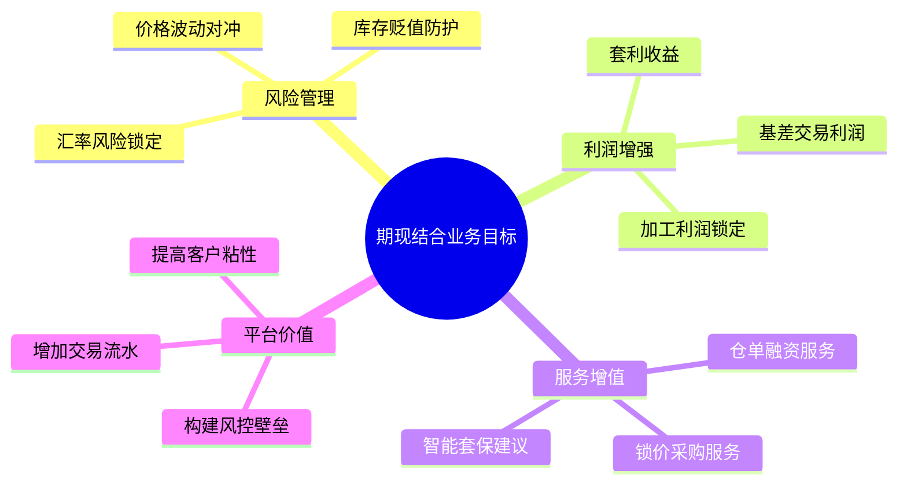

### 1.3 输入/输出与约束

| 维度 | 内容 |
|------|------|
| **核心输入** | ① 实时期货行情(K线/分时/深度)；② 现货报价(仓库/钢厂/港口)；③ 用户持仓(期货持仓+现货库存)；④ 交易所规则(保证金/涨跌停/交割) |
| **核心输出** | ① 套保方案建议；② 风险敞口报告；③ 保证金占用预估；④ 盈亏归因分析 |
| **关键约束** | ① 期货T+0 vs 现货T+N交收；② 最小交易单位(手) vs 现货起订量(吨)；③ 交割库与现货仓库的地理错配；④ 保证金追缴的时效要求(通常T+1 15:00前) |

---

## 2. 期货与现货结合的策略模式

### 2.1 策略全景图

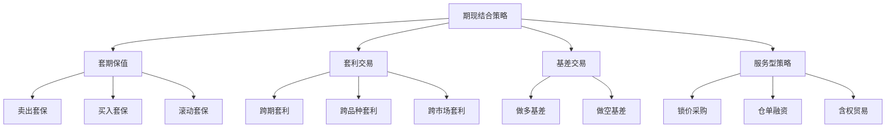

### 2.2 各策略详细分析

#### 策略一：卖出套期保值（Short Hedge）

| 要素 | 描述 |
|------|------|
| **目标** | 对冲现货库存的贬值风险 |
| **操作** | 持有现货多头 → 在期货市场卖出等量空头合约 |
| **输入** | 现货库存量(吨)、当前现货价格、对应期货合约价格 |
| **输出** | 套保比率建议、保证金占用、对冲效果评估 |
| **适用条件** | ① 有现货库存；② 预期价格下行；③ 期货合约有流动性 |
| **关键参数** | 套保比率 β = 期货数量/现货数量 (通常0.7-1.0)；合约月份选择(主力合约优先) |
| **平台收益** | 收取交易佣金 + 套保服务费 |

**工作原理**：
```
价格下跌场景：现货亏损 + 期货空头盈利 = 净亏损大幅缩小（完美对冲时≈0）
价格上涨场景：现货盈利 + 期货空头亏损 = 净盈利大幅缩小（放弃了上涨收益）
→ 本质：锁定当前价格，减少不确定性
```

#### 策略二：买入套期保值（Long Hedge）

| 要素 | 描述 |
|------|------|
| **目标** | 锁定未来采购成本，防止原材料涨价 |
| **操作** | 未来需采购现货 → 现在买入期货多头合约 |
| **输入** | 未来采购量/时间、当前期货价格、预算上限 |
| **输出** | 建仓时机建议、成本锁定效果、盈亏概率分析 |
| **适用条件** | ① 未来确定有采购需求；② 预期价格上涨；③ 有保证金支付能力 |

#### 策略三：跨品种套利（Spread Trading）

| 要素 | 描述 |
|------|------|
| **目标** | 利用关联品种价差异常赚取回归收益 |
| **操作** | 做多低估品种 + 做空高估品种 |
| **典型组合** | ① 螺纹钢-热卷(RB-HC)；② 豆油-豆粕(Y-M)；③ 焦炭-焦煤(J-JM)；④ 铁矿-螺纹钢(I-RB) 即钢厂利润套利 |
| **输入** | 两品种历史价差序列、当前价差位置、价差均值与标准差 |
| **输出** | 入场信号(价差偏离>2σ)、目标价差、止损价差 |
| **关键约束** | 两合约乘数可能不同，需调整手数比例 |

**螺纹钢-热卷套利实例**：

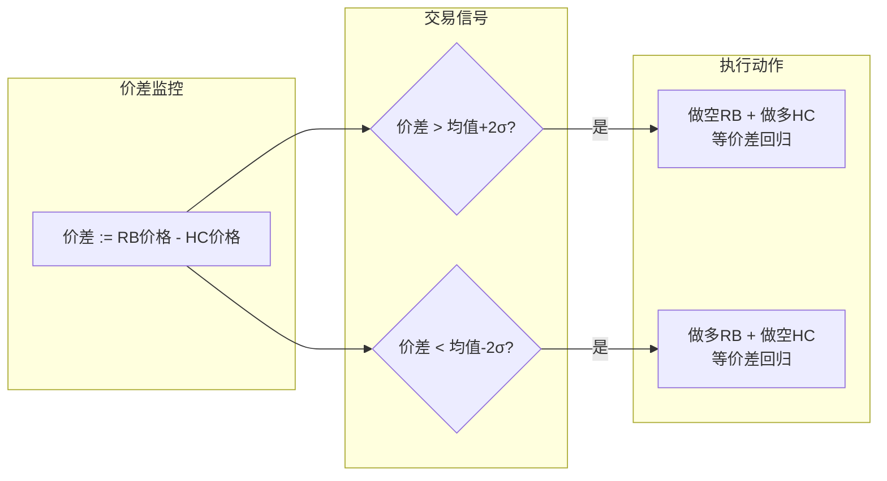

#### 策略四：基差交易（Basis Trading）

| 要素 | 描述 |
|------|------|
| **目标** | 利用期现价差异常波动赚取基差回归收益 |
| **核心概念** | 基差 = 现货价格 - 期货价格。正常市场：现货>期货(正值)；反向市场：现货<期货(负值) |
| **做多基差** | 买入现货 + 卖出期货 → 预期基差扩大 |
| **做空基差** | 卖出现货 + 买入期货 → 预期基差收窄 |
| **关键难点** | 现货端操作需要实际货权和仓储能力，非纯金融交易 |

#### 策略五：锁价采购服务（价值链延伸）

| 要素 | 描述 |
|------|------|
| **业务本质** | 平台为下游客户提供「固定价格+延期提货」服务，背后用期货对冲自身风险 |
| **客户价值** | 锁定采购成本，规避未来涨价风险 |
| **平台风险** | 承担了客户转移的价格风险，必须通过期货市场精确对冲 |
| **计费模型** | 锁价费 = 锁价金额 × 费率(0.3%-1%) + 资金占用利息 |
| **核心能力** | 精确的敞口计算 + 动态对冲执行 + 追保资金准备 |

---

## 3. 关键业务流程设计

### 3.1 总体业务流程

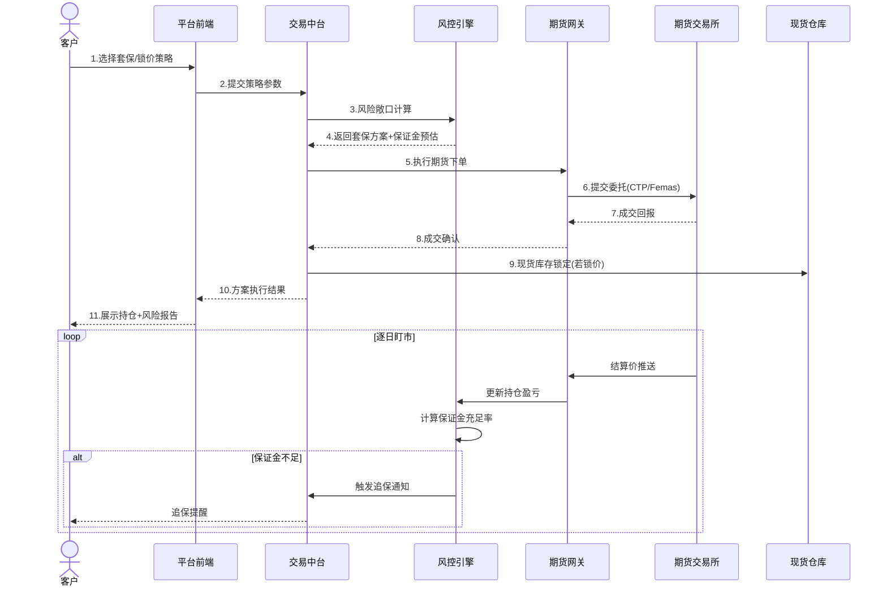

### 3.2 套保方案推荐流程

```mermaid
flowchart TD
    A[客户输入] --> B{场景分类}
    
    B -->|持有现货库存| C1[卖出套保场景]
    B -->|计划采购| C2[买入套保场景]
    B -->|锁定利润| C3[价差套利场景]
    
    C1 --> D1[获取:现货库存数据<br/>现货品种/数量/成本]
    C2 --> D2[获取:采购计划数据<br/>品种/数量/时间/预算]
    C3 --> D3[获取:价差历史数据<br/>两品种价差序列]
    
    D1 --> E[风控引擎计算]
    D2 --> E
    D3 --> E
    
    E --> E1{参数校验通过?}
    E1 -- 否 --> E2[返回:不通过原因+修正建议]
    E1 -- 是 --> E3[生成套保方案]
    
    E3 --> F1[方案要素1:套保比率β]
    E3 --> F2[方案要素2:合约选择(月份)]
    E3 --> F3[方案要素3:手数计算]
    E3 --> F4[方案要素4:保证金预估]
    E3 --> F5[方案要素5:止损/止盈规则]
    
    F1 & F2 & F3 & F4 & F5 --> G[方案预览→客户确认]
    G -- 确认 --> H[执行下单]
    G -- 调整 --> A
```

**套保手数计算公式**：
```
期货手数 = (现货量 × 套保比率) / (合约乘数)
         = (500吨 × 0.8) / (10吨/手)
         = 40手

其中: 套保比率β由两个因素决定:
  ① 期货与现货的相关性 ρ (相关性越高,β越接近1)
  ② 最小方差套保比率 h = ρ × (σ_spot / σ_future)
```

### 3.3 锁价采购核心流程

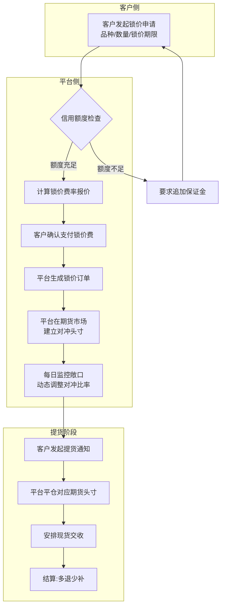

### 3.4 每日盯市与动态对冲流程

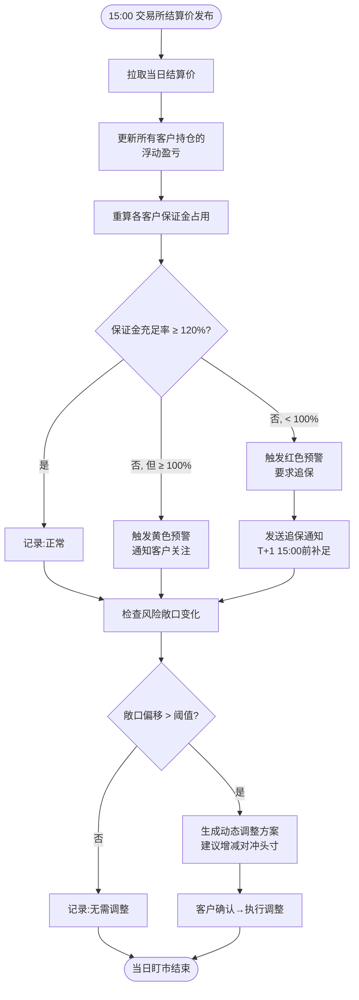

---

## 4. 风险控制机制

### 4.1 风控体系全景

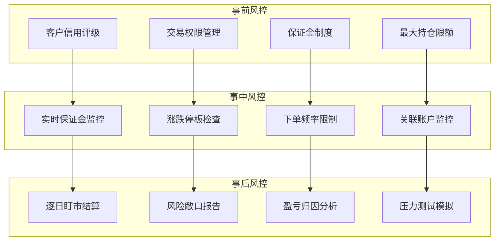

### 4.2 仓位管理规则

| 规则类型 | 计算方式 | 阈值设定 | 超限处理 |
|----------|----------|----------|----------|
| **单品种持仓上限** | 单品种净持仓 / 总权益 ≤ X% | X=20% (保守) / 30% (标准) / 40% (激进) | 拒绝新开仓，提示减仓 |
| **总持仓上限** | 总持仓保证金 / 总权益 ≤ Y% | Y=60% (保守) / 70% (标准) / 80% (激进) | 拒绝新开仓，强制减仓通知 |
| **套保比率偏离** | 实际套保比率 - 目标比率 | 偏离绝对值 ≤ 10% | 触发动态调整建议 |
| **净敞口限制** | 现货多头 - 期货空头净敞口 | 净敞口 ≤ 现货总量 × (1-β_max) | 强制补充对冲头寸 |
| **流动性检查** | 委托量 / 标的日均成交量 | ≤ 5% (避免冲击) | 拆分大单为小单分批执行 |

### 4.3 止损规则设计

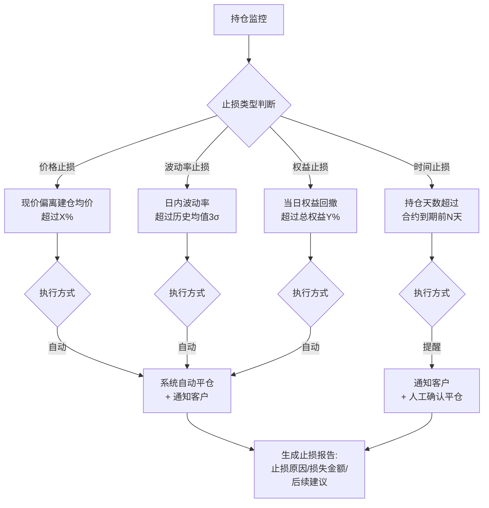

**止损参数推荐**：

| 策略类型 | 价格止损 | 权益止损 | 时间止损 | 执行方式 |
|----------|----------|----------|----------|----------|
| 卖出套保 | 不设止损(现货对冲) | 不设止损 | 合约到期前5天展期 | 提醒 |
| 买入套保 | 不设止损(成本锁定) | 不设止损 | 合约到期前5天展期 | 提醒 |
| 跨品种套利 | 价差回撤>1.5σ | 总权益回撤>5% | 价差15天未回归 | 自动 |
| 基差交易 | 基差逆向>2σ | 总权益回撤>3% | 合约到期前7天平仓 | 自动 |
| 锁价对冲(平台侧) | - | 保证金追缴 | - | 自动 |

### 4.4 保证金监控体系

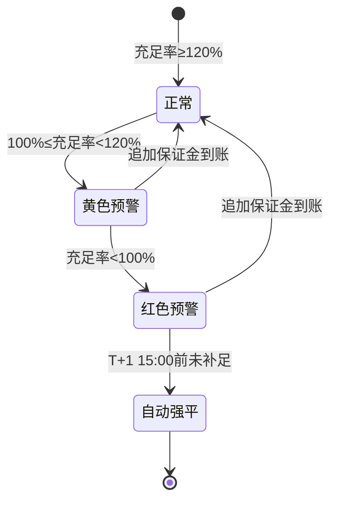

**保证金监控关键指标**：

| 指标 | 公式 | 预警阈值 | 强平阈值 |
|------|------|----------|----------|
| 保证金充足率 | (权益-浮动亏损) / 占用保证金 | < 120% 黄色预警 | < 100% + T+1未补 |
| 可用资金 | 权益 - 占用保证金 - 浮动亏损 | < 0 | 触发追保 |
| 风险度 | 占用保证金 / 权益 | > 80% 注意; > 90% 预警 | > 100% 强平 |

### 4.5 信用风险管理

| 管理环节 | 措施 | 工具/方法 |
|----------|------|-----------|
| 准入评估 | 企业资质审核、历史交易记录、财务报表 | 工商信息核验 + 天眼查/企查查对接 |
| 额度授信 | 基于净资产、交易量、历史履约率计算 | 授信额度 = min(净资产×5%, 历史最大持仓×3) |
| 动态调整 | 根据履约率、市场波动动态调整额度 | 履约率<95%:降额20%; 市场波动率>30%:降额30% |
| 担保措施 | 保证金+标准仓单质押+第三方担保 | 保证金比率 = 基础比率 + 信用风险溢价 |

---

## 5. 系统架构与数据流设计

### 5.1 总体系统架构


### 5.2 数据流设计

#### 5.2.1 行情数据流

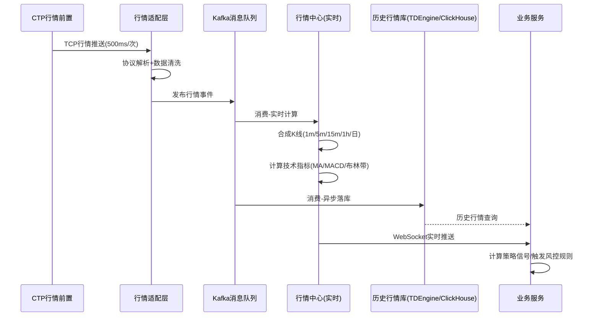

#### 5.2.2 交易数据流

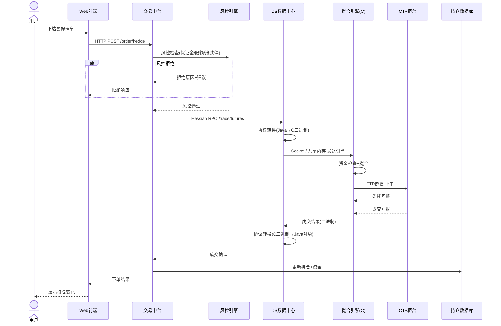

#### 5.2.3 结算数据流

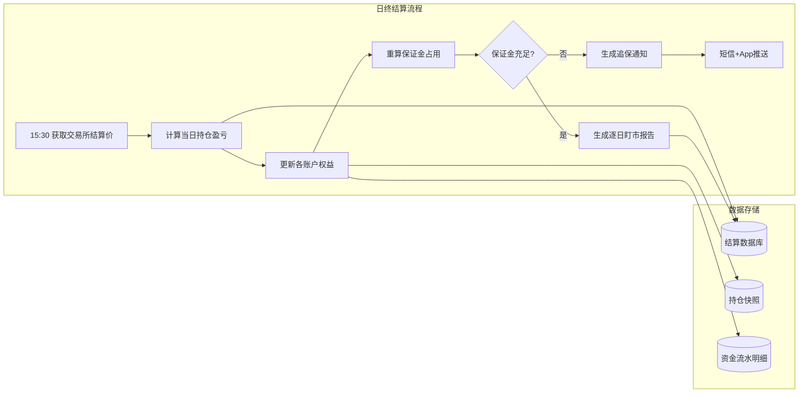

### 5.3 关键数据模型设计

#### 持仓聚合模型

| 字段 | 类型 | 说明 |
|------|------|------|
| account_id | varchar(32) | 账户唯一标识 |
| instrument_id | varchar(16) | 合约代码(如rb2601) |
| position_type | tinyint | 1=期货多头, 2=期货空头, 3=现货库存 |
| volume | decimal(20,4) | 持仓量(吨/手) |
| avg_price | decimal(20,4) | 建仓均价 |
| market_price | decimal(20,4) | 最新市价 |
| floating_pnl | decimal(20,4) | 浮动盈亏 |
| margin_used | decimal(20,4) | 已用保证金 |
| hedge_ratio | decimal(10,4) | 当前套保比率 |

#### 风险敞口表

| 字段 | 类型 | 说明 |
|------|------|------|
| exposure_id | varchar(32) | 敞口ID |
| account_id | varchar(32) | 账户ID |
| product_group | varchar(16) | 品种分组(如黑色/有色/农产品) |
| spot_long | decimal(20,4) | 现货多头量 |
| future_short | decimal(20,4) | 期货空头量 |
| net_exposure | decimal(20,4) | 净敞口 = spot_long - future_short × 合约乘数 |
| delta_exposure | decimal(20,4) | Delta敞口(考虑对冲比率的实际风险敞口) |
| var_95 | decimal(20,4) | 95%置信度VaR值 |
| update_time | datetime | 更新时间 |

### 5.4 异构系统通信设计

基于现有架构（C撮合引擎 + Java业务中台），期现结合场景下的通信设计：

```
┌──────────────────────┐
│    Java 业务中台      │
│  ┌────────────────┐  │
│  │  风控引擎       │  │ ← Hessian over HTTP (同步): 风控检查、持仓查询
│  │  策略引擎       │  │ ← Socket (异步): 订单提交、成交回报、行情推送
│  │  交易核心       │  │
│  └───────┬────────┘  │
└──────────┼───────────┘
           │
    ┌──────▼───────────┐
    │  DS 数据中心      │  ← Anti-Corruption Layer
    │  (Java 防腐层)    │    协议转换: Java ↔ C二进制
    │  ┌────────────┐  │    序列化: Hessian
    │  │ 协议适配器  │  │    通信: Socket + HTTP
    │  │ 数据转换器  │  │
    │  └──────┬─────┘  │
    └─────────┼────────┘
              │
    ┌─────────▼────────┐
    │  C 撮合引擎       │  ← 单线程内存撮合
    │  ┌────────────┐  │    异步落库(不阻塞主循环)
    │  │ 内存订单簿  │  │    对外暴露: 二进制协议接口
    │  │ 撮合主循环  │  │
    │  │ 异步写库    │  │
    │  └────────────┘  │
    └──────────────────┘
```

**DS数据中心在期现结合场景的关键价值**：
- C引擎只暴露二进制协议 → DS将其翻译为Java业务中台可消费的Hessian对象
- 同步调用走Hessian over HTTP（风控查询等低延迟场景）
- 异步推送走Socket（行情、成交回报等高频场景）
- 这种设计让Java技术经理能直接review DS代码，是「管住」异构系统的抓手

---

## 6. 各环节异常处理方案

### 6.1 异常分类框架

```mermaid
flowchart TD
    A[异常分类] --> B[基础设施异常]
    A --> C[业务异常]
    A --> D[市场异常]
    A --> E[数据异常]
    
    B --> B1[CTP连接断开]
    B --> B2[数据库主从切换]
    B --> B3[消息队列积压]
    B --> B4[网络超时]
    
    C --> C1[保证金不足]
    C --> C2[下单被拒(风控)]
    C --> C3[持仓超限]
    C --> C4[合约到期未展期]
    
    D --> D1[涨跌停板]
    D --> D2[流动性枯竭]
    D --> D3[合约临时停牌]
    D --> D4[极端行情(黑天鹅)]
    
    E --> E1[行情数据延迟/缺失]
    E --> E2[结算价异常]
    E --> E3[现货报价失真]
    E --> E4[品种映射错误]
```

### 6.2 各环节异常处理详表

#### 6.2.1 基础设施异常

| 异常场景 | 感知方式 | 自动处理 | 人工处理 | 恢复后处理 | 降级策略 |
|----------|----------|----------|----------|------------|----------|
| **CTP连接断开** | 心跳超时(3s无响应) | 自动重连(最多3次) | 重连失败→通知运维+运营 | 校验未成交订单状态(撤单/重发) | 暂停期货交易，现货交易正常 |
| **数据库主从切换** | 连接池异常捕获 | 连接池自动Failover | 通知DBA排查原因 | 数据一致性校验 | 读操作走从库(可能有延迟) |
| **Kafka积压** | 消费Lag监控 > 阈值 | 扩容消费者实例 | 排查下游处理瓶颈 | 回放积压消息 | 行情降级为轮询模式 |
| **网络超时** | 请求超时(>5s) | 重试机制(最多3次,指数退避) | 网络排查 | 幂等性校验 | 本地缓存兜底 |

#### 6.2.2 业务异常

| 异常场景 | 检测时机 | 处理规则 | 用户通知 | 恢复机制 |
|----------|----------|----------|----------|----------|
| **保证金不足** | 每日盯市+实时下单 | 黄色预警→通知;红色→T+1追保;超期→强平 | 短信+App推送+站内信 | 入金到账→解除预警→恢复交易 |
| **风控拒绝下单** | 下单前事中检查 | 返回拒绝原因+参数建议 | 前端即时展示 | 调整参数→重新提交 |
| **持仓超限** | 下单前+日终检查 | 拒绝超限开仓请求 | 即时告知 | 减仓至限额内→恢复开仓权限 |
| **合约到期未展期** | 到期前5天+3天+1天提醒 | 自动计算展期方案(平旧开新) | 多级提醒阶梯 | 执行展期操作 |

#### 6.2.3 市场异常

| 异常场景 | 识别规则 | 系统响应 | 恢复条件 |
|----------|----------|----------|----------|
| **涨跌停板** | 行情价格=涨跌停价 | 暂停该合约开仓; 按交易所规则排队平仓 | 次日开盘恢复 |
| **流动性枯竭** | 盘口买卖价差>正常5倍 / 成交量<日均20% | 预警提示; 建议等待流动性恢复再操作 | 流动性恢复 |
| **合约停牌** | 交易所公告/行情中断 | 暂停该合约所有操作; 标记持仓为「停牌」 | 交易所公告复牌 |
| **极端行情(黑天鹅)** | 日内波动>历史3σ / 触发熔断 | 全品种暂停新开仓; 收紧止损阈值; 启动应急预案 | 波动率回归正常范围 |

#### 6.2.4 数据异常

| 异常场景 | 检测方式 | 处理策略 | 对业务影响 |
|----------|----------|----------|------------|
| **行情延迟** | 行情时间戳 vs 本地时间 >1s | 切换备用行情源; 标记数据质量 | 策略信号可能滞后; 暂停高频策略 |
| **行情缺失(跳空)** | 前后两笔行情价格跳变>2% | 暂时冻结基于该价格的策略触发; 人工确认 | 套利策略可能误触发 |
| **结算价异常** | 与盘中价偏差>涨跌停5% | 人工复核; 以交易所官方结算价为准 | 影响保证金计算(若有误需回冲) |
| **现货报价失真** | 偏离近期均价>5% / 跨仓库价差异常 | 标记为可疑; 暂停以此为基础的计算 | 基差计算失准 |

### 6.3 极端场景应急预案

```mermaid
flowchart TD
    subgraph 场景一_连续涨跌停
        A1[首日涨停/跌停] --> A2[暂停该品种开仓]
        A2 --> A3[评估客户持仓风险]
        A3 --> A4{有穿仓风险?}
        A4 -- 是 --> A5[启动强平减仓方案]
        A4 -- 否 --> A6[持续监控,每日报告]
        A5 --> A6
    end
    
    subgraph 场景二_交易所系统故障
        B1[无法获取行情/无法下单] --> B2[切换备用柜台(如有)]
        B2 --> B3{备用可用?}
        B3 -- 否 --> B4[暂停期货操作<br/>通知所有客户]
        B3 -- 是 --> B5[使用备用柜台<br/>标记数据源]
    end
    
    subgraph 场景三_账户穿仓
        C1[权益<0] --> C2[冻结该账户所有操作]
        C2 --> C3[通知客户补足资金]
        C3 --> C4{客户是否回应?}
        C4 -- 回应+同意补足 --> C5[设置补足期限+监管]
        C4 -- 不回应/拒绝 --> C6[启动法律追偿程序]
    end
```

### 6.4 异常处理的设计原则

| 原则 | 说明 | 实现方式 |
|------|------|----------|
| **幂等性** | 同一笔订单重复提交不会造成重复成交 | 订单唯一ID + 状态机 + 数据库唯一约束 |
| **可追溯** | 任何异常都有完整的调用链日志 | 分布式Trace ID贯穿全链路 |
| **可回滚** | 关键操作支持补偿/回滚 | Saga模式 + 补偿事务 |
| **降级优先** | 核心路径优先保障，非核心可降级 | 熔断器 + 限流 + 兜底策略 |
| **通知不遗漏** | 追保/强平等关键通知必须有确认机制 | 多通道(短信+App+站内信) + 确认回执 |
| **人工兜底** | 自动处理有上限，关键决策人审 | 自动处理→阈值→人工决策的双层架构 |

---

## 7. 面试话术框架（技术经理视角）

> 以下为面试中阐述期货结合系统时的核心话术，根据你的实际系统架构（C撮合+Java中台+DS防腐层）定制。

### 7.1 系统架构描述

> "我们的期现结合系统采用**异构四层架构**。最底层是**C语言撮合引擎**，单线程内存撮合、异步落库，保证极低延迟。上面是**DS数据中心**，作为防腐层把C引擎的二进制协议翻译成Java对象。再上层是**Java微服务业务中台**，包含交易、风控、策略等12+服务集群。这套架构的核心优势是：**性能关键路径用C保证速度，业务复杂度用Java保证可维护性**。"

### 7.2 风控设计亮点

> "风控我们做了**事前-事中-事后三层**。事前有信用评级和额度授信；事中有**实时保证金监控**和下单校验；事后有**逐日盯市**和压力测试。保证金计算、止损触发这些规则都配置在风控引擎里，可以动态调整。比如锁价业务，我们会**精确计算客户的Delta敞口**，平台侧同步在期货市场建立对冲头寸，每天根据现货库存变化动态调整。"

### 7.3 异构系统通信方案

> "C和Java之间的通信我们用了两种模式：**同步走Hessian over HTTP**，用于风控查询等需要即时返回的场景；**异步走Socket**，用于行情推送和成交回报这种高频场景。DS数据中心就是这个翻译层，它同时把协议转换做好，让Java侧不用关心C内部怎么实现的。**这个DS层是我能直接review代码的地方**，有了它我就能管住整个链路的稳定性。"

### 7.4 最大挑战与解决

> "最大的挑战是**期现头寸的实时敞口计算**。现货端数据来自不同仓库的WMS系统，数据质量参差不齐、更新频率也不一致。期货端是秒级行情。两边要实时对账算出净敞口。我们的解决方案是：**先建一个统一的持仓聚合模型**，用事件驱动的方式把现货入库、期货成交都转成持仓变更事件，然后在内存中实时聚合。异常情况通过**Saga补偿机制**处理，比如期货下单成功但现货入库失败，会自动取消对应的期货头寸。"

---

## 附录A：期现结合系统核心能力自检清单

| 能力域 | 核心能力 | 自检问题 |
|--------|----------|----------|
| 行情 | 多源行情聚合 | 是否支持至少2个行情源做容灾切换？ |
| 交易 | 统一订单管理 | 期货和现货订单是否能关联查询和联合分析？ |
| 风控 | 实时敞口计算 | 净敞口计算延迟是否<1秒？ |
| 风控 | 保证金监控 | 追保通知从触发到送达是否<5分钟？ |
| 数据 | 历史数据存储 | 是否支持至少3年历史数据的秒级查询？ |
| 系统 | 异构通信 | C-Java通信是否有完整的超时和重试机制？ |
| 运维 | 监控告警 | 是否有全链路的Trace追踪和异常自动告警？ |

## 附录B：行业参考

| 参考平台 | 特色 | 参考价值 |
|----------|------|----------|
| 上海钢联(Mysteel) | 现货报价+期货行情一体化 | 行情聚合设计 |
| 找钢网 | 锁价采购+供应链金融 | 期现结合业务模式 |
| 点钢网 | 基差交易+套保服务 | 策略引擎设计 |
| CTM(大宗交易管理系统) | 风控+敞口管理 | 风控模型设计 |
| 文华财经 | 程序化交易+策略回测 | 策略引擎与回测框架 |

---

*文档版本: v1.0 | 生成日期: 2026-07-20 | 适用场景: B2B大宗贸易期现结合平台架构设计*